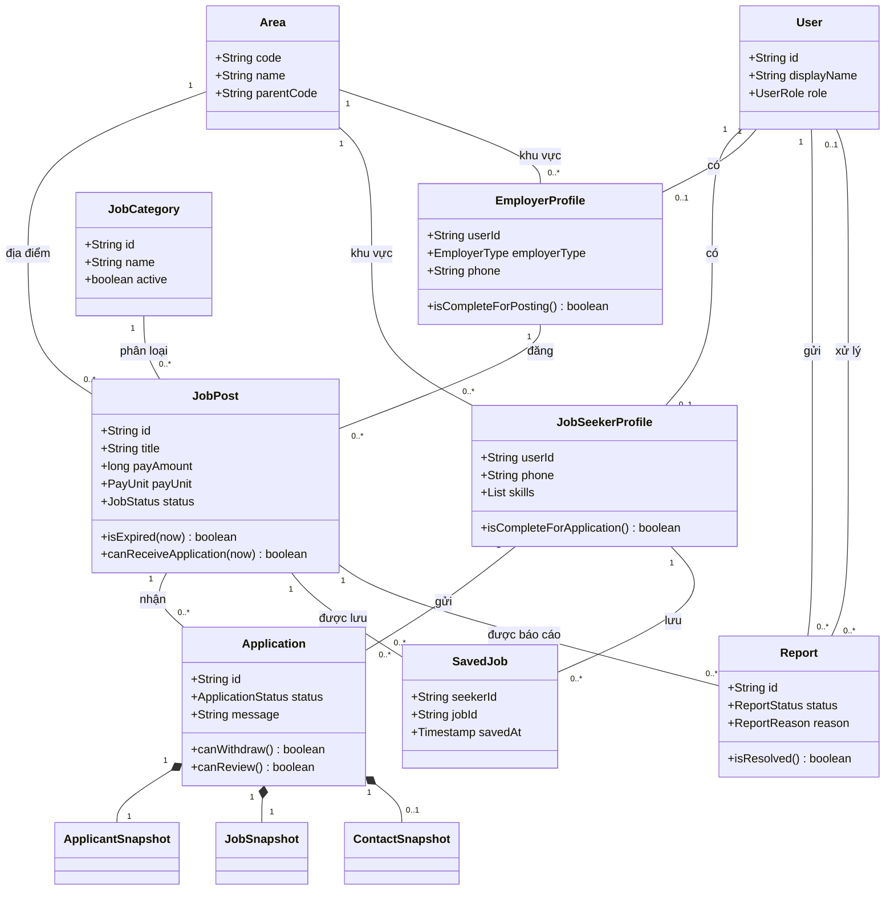

# GrandMaAssist
**BẢN PHÂN TÍCH VÀ THIẾT KẾ SƠ BỘ — GRANDMA ASSIST**

**1. Tổng quan hệ thống**

**Tên đề tài:** GrandMa Assist — Ứng dụng hỗ trợ tìm việc làm bán thời gian cho người nghỉ hưu.

**Mục tiêu:** Kết nối người nghỉ hưu có nhu cầu làm việc với cá nhân, gia đình hoặc doanh nghiệp nhỏ cần tuyển lao động bán thời gian.

**Thành viên thực hiện:**
- Phùng Cẩm Tân (leader)

Ứng dụng tập trung giải quyết ba vấn đề:

- Người lớn tuổi khó tìm được công việc phù hợp về địa điểm, thời gian và yêu cầu công việc.
- Quy trình tìm việc và ứng tuyển thường đòi hỏi nhiều thao tác, nhập liệu.
- Người tìm việc cần thông tin tuyển dụng rõ ràng và cơ chế báo cáo nội dung không phù hợp.

**Nền tảng triển khai:** Ứng dụng Android viết bằng Java, giao diện XML, sử dụng Firebase Authentication và Cloud Firestore. SQLite lưu nội dung phục vụ xem ngoại tuyến.

**Phạm vi bản đầu:** Đăng việc, duyệt tin, tìm việc, ứng tuyển, xử lý ứng viên và liên hệ bằng điện thoại. Chưa triển khai chat, thanh toán, đánh giá, AI gợi ý việc hoặc tính khoảng cách GPS.

---

**2. Đối tượng sử dụng và nhu cầu**

| Đối tượng | Đặc điểm | Nhu cầu chính |
|---|---|---|
| Người tìm việc | Người nghỉ hưu, khoảng 55–65+ tuổi; có thể ít quen công nghệ | Tìm việc gần khu vực sinh sống, lịch làm phù hợp, ít thao tác |
| Người tuyển dụng | Cá nhân, gia đình, doanh nghiệp nhỏ | Đăng việc dễ dàng, xem thông tin ứng viên, liên hệ nhanh |
| Quản trị viên | Người vận hành ứng dụng | Kiểm duyệt tin và xử lý báo cáo |
| Khách | Người chưa đăng nhập | Xem và tìm hiểu việc làm trước khi sử dụng |

Độ tuổi trên là định hướng thiết kế, **không phải điều kiện tự động cấm người ngoài nhóm tuổi đăng ký**.

Một số tình huống sử dụng tiêu biểu:

- Người nghỉ hưu muốn tìm việc chăm sóc cây vào buổi sáng trong khu vực mình sống.
- Một gia đình muốn đăng tin tìm người nấu ăn vài buổi mỗi tuần.
- Người tìm việc mở lại một tin đã xem khi thiết bị mất mạng.
- Admin nhận báo cáo về một tin có nội dung không phù hợp và quyết định ẩn tin.

---

**3. Giả định và giới hạn nghiệp vụ**

Các quy ước sau được đề xuất để giữ phạm vi rõ ràng:

1. Mỗi tài khoản thông thường chọn một vai trò: người tìm việc hoặc người tuyển dụng.
2. Bản đầu chưa hỗ trợ tự chuyển đổi vai trò.
3. Admin được cấp quyền riêng, không xuất hiện trong lựa chọn đăng ký.
4. Cả ba vai trò sử dụng cùng một ứng dụng Android.
5. “Việc gần nhà” được thực hiện bằng lọc khu vực, chưa tính khoảng cách thực tế.
6. Hồ sơ ứng tuyển sử dụng thông tin đã khai báo, không yêu cầu tải CV.
7. Một tin có thể nhận nhiều đơn và chấp nhận nhiều ứng viên; bản đầu chưa quản lý chỉ tiêu tuyển dụng.
8. Chấp nhận đơn có nghĩa là đồng ý kết nối để trao đổi tiếp, chưa đồng nghĩa với ký hợp đồng hoặc hoàn thành công việc.
9. Việc kiểm duyệt chỉ đánh giá nội dung tin, không được trình bày như một bảo đảm về danh tính hoặc độ an toàn tuyệt đối.

---

**4. Yêu cầu chức năng**

| Mã | Chức năng | Mô tả |
|---|---|---|
| F01 | Đăng nhập, đăng xuất | Đăng nhập bằng tài khoản Google và kết thúc phiên sử dụng |
| F02 | Thiết lập vai trò | Chọn vai trò khi sử dụng lần đầu |
| F03 | Quản lý hồ sơ | Cập nhật thông tin phù hợp với vai trò |
| F04 | Xem danh sách việc | Hiển thị các tin được duyệt, đang tuyển và chưa hết hạn |
| F05 | Lọc việc | Lọc theo danh mục, khu vực và ca làm |
| F06 | Xem chi tiết việc | Xem nhiệm vụ, yêu cầu, thời gian, mức trả và thông tin người đăng |
| F07 | Lưu việc | Lưu hoặc bỏ lưu tin quan tâm |
| F08 | Ứng tuyển | Gửi thông tin hồ sơ và lời nhắn ngắn nếu cần |
| F09 | Theo dõi đơn | Xem danh sách đơn và trạng thái xử lý |
| F10 | Rút đơn | Rút đơn đang chờ xử lý |
| F11 | Đăng tin | Tạo tin và gửi kiểm duyệt |
| F12 | Sửa, đóng tin | Chỉnh sửa nội dung hoặc ngừng nhận ứng tuyển |
| F13 | Xem ứng viên | Xem các đơn thuộc tin của mình |
| F14 | Xử lý đơn | Chấp nhận hoặc từ chối ứng viên |
| F15 | Liên hệ | Mở trình quay số với thông tin liên hệ được phép xem |
| F16 | Báo cáo tin | Gửi lý do và mô tả vấn đề |
| F17 | Kiểm duyệt tin | Duyệt hoặc từ chối kèm lý do |
| F18 | Xử lý báo cáo | Xem báo cáo, ghi kết quả và ẩn tin khi cần |
| F19 | Xem ngoại tuyến | Xem lại nội dung việc đã tải về thiết bị |

**Thông tin hồ sơ tối thiểu**

| Người tìm việc | Người tuyển dụng |
|---|---|
| Họ tên hiển thị | Tên cá nhân hoặc đơn vị |
| Số điện thoại | Số điện thoại |
| Khu vực sinh sống | Loại người tuyển dụng: cá nhân hoặc tổ chức |
| Kỹ năng | Khu vực |
| Kinh nghiệm ngắn gọn | Giới thiệu ngắn |
| Ca làm mong muốn | — |

**Thông tin tin tuyển dụng**

- Tiêu đề và danh mục công việc.
- Mô tả nhiệm vụ, yêu cầu.
- Khu vực làm việc.
- Ca làm và mô tả lịch cụ thể.
- Mức trả, đơn vị trả: theo giờ, buổi hoặc ngày.
- Hạn nhận ứng tuyển.
- Trạng thái và thời điểm tạo/cập nhật.

Địa chỉ nhà cụ thể và số điện thoại không xuất hiện trong danh sách tin công khai. Hai bên có thể trao đổi chi tiết sau khi kết nối.

---

**5. Yêu cầu phi chức năng**

| Nhóm | Yêu cầu và tiêu chí kiểm tra |
|---|---|
| Dễ sử dụng | Nhãn bằng tiếng Việt rõ ràng; thao tác chính có chữ; hạn chế nhập liệu dài |
| Khả năng đọc | Chữ có thể tăng theo cài đặt hệ thống; thông tin không bị che khi tăng cỡ chữ |
| Responsive | Hỗ trợ xoay màn hình; giữ bộ lọc và nội dung đang nhập |
| Độ tin cậy | Không tạo đơn trùng khi bấm nhiều lần hoặc xoay màn hình |
| Phân quyền | Kiểm tra quyền tại Firestore; không chỉ ẩn nút trên giao diện |
| Riêng tư | Không công khai số điện thoại và nội dung hồ sơ ứng tuyển |
| Ngoại tuyến | Hiển thị nội dung đã tải cùng thông báo dữ liệu có thể đã cũ |
| Hiệu năng | Tải danh sách theo trang; không tải toàn bộ dữ liệu hệ thống một lần |
| Khả năng bảo trì | Tách giao diện, xử lý trạng thái, nghiệp vụ và truy cập dữ liệu |

Không hiển thị “Thành công” khi dữ liệu quan trọng chưa được dịch vụ xác nhận.

---

**6. Sơ đồ phân rã chức năng**

```mermaid
flowchart TB
    A["GrandMa Assist"]

    A --> B["1. Tài khoản và hồ sơ"]
    A --> C["2. Tìm việc và ứng tuyển"]
    A --> D["3. Tuyển dụng"]
    A --> E["4. Quản trị"]
    A --> F["5. Truy cập ngoại tuyến"]

    B --> B1["Đăng nhập / Đăng xuất"]
    B --> B2["Thiết lập vai trò"]
    B --> B3["Cập nhật hồ sơ"]

    C --> C1["Xem và lọc việc"]
    C --> C2["Xem chi tiết"]
    C --> C3["Lưu / Bỏ lưu"]
    C --> C4["Gửi đơn ứng tuyển"]
    C --> C5["Theo dõi / Rút đơn"]
    C --> C6["Liên hệ"]
    C --> C7["Báo cáo tin"]

    D --> D1["Tạo / Sửa tin"]
    D --> D2["Gửi tin chờ duyệt"]
    D --> D3["Đóng tin"]
    D --> D4["Xem ứng viên"]
    D --> D5["Chấp nhận / Từ chối"]
    D --> D6["Liên hệ"]

    E --> E1["Duyệt / Từ chối tin"]
    E --> E2["Xem báo cáo"]
    E --> E3["Ẩn tin vi phạm"]
    E --> E4["Ghi kết quả xử lý"]

    F --> F1["Lưu nội dung đã tải"]
    F --> F2["Xem lại khi mất mạng"]
    F --> F3["Cập nhật khi có mạng"]
```



Sơ đồ này thể hiện cách phân chia chức năng, không thể hiện thứ tự thao tác.

---

**7. Thiết kế Use Case**

**7.1. Tác nhân và các use case**

| Tác nhân | Use case |
|---|---|
| Khách | Xem danh sách, lọc việc, xem chi tiết, đăng nhập |
| Người tìm việc | Quản lý hồ sơ, tìm việc, lưu việc, ứng tuyển, theo dõi đơn, rút đơn, liên hệ, báo cáo tin, đăng xuất |
| Người tuyển dụng | Quản lý hồ sơ, đăng/sửa/đóng tin, xem ứng viên, xử lý đơn, liên hệ, đăng xuất |
| Admin | Xem tin chờ duyệt, duyệt/từ chối tin, xử lý báo cáo, ẩn tin, đăng xuất |
| Google/Firebase Authentication | Hỗ trợ xác thực đăng nhập |

Khi vẽ:

- Biên hệ thống có tên **GrandMa Assist**.
- Có thể dùng tác nhân tổng quát **Người dùng đã đăng nhập**, rồi chuyên biệt thành ba vai trò.
- “Đã đăng nhập” là tiền điều kiện của nghiệp vụ cần xác thực.
- Không dùng `include` để biểu diễn thao tác nào xảy ra trước thao tác nào.
- Các bước kiểm tra quyền, kiểm tra trạng thái thường nằm trong đặc tả, không nhất thiết tách thành use case độc lập.

**7.2. UC01 — Đăng nhập và thiết lập hồ sơ**

| Thành phần | Nội dung |
|---|---|
| Tác nhân | Người dùng |
| Tiền điều kiện | Có kết nối mạng |
| Luồng chính | Chọn đăng nhập Google → xác thực → kiểm tra tài khoản → nếu là người dùng mới, chọn vai trò và bổ sung hồ sơ → vào giao diện tương ứng |
| Ngoại lệ | Hủy đăng nhập; xác thực thất bại; mất mạng; chưa hoàn tất hồ sơ |
| Hậu điều kiện | Người dùng có phiên đăng nhập; chỉ truy cập nghiệp vụ khi đáp ứng điều kiện hồ sơ |
| Quy tắc | Người dùng mới không được chọn admin |

**7.3. UC02 — Đăng và gửi tin chờ duyệt**

| Thành phần | Nội dung |
|---|---|
| Tác nhân | Người tuyển dụng |
| Tiền điều kiện | Đã đăng nhập, hồ sơ hợp lệ, có mạng |
| Luồng chính | Mở form → nhập nội dung → xem trước → gửi → hệ thống kiểm tra dữ liệu → tạo tin `PENDING_REVIEW` |
| Ngoại lệ | Thiếu trường bắt buộc; mức trả không hợp lệ; hạn nhận đơn đã qua; lỗi kết nối |
| Hậu điều kiện | Tin xuất hiện trong danh sách của chủ tin và hàng đợi admin, chưa công khai |

**7.4. UC03 — Duyệt tin**

| Thành phần | Nội dung |
|---|---|
| Tác nhân | Admin |
| Tiền điều kiện | Tin đang chờ duyệt; admin có quyền |
| Luồng chính | Mở tin → đọc nội dung → chọn duyệt → hệ thống kiểm tra trạng thái hiện tại → chuyển sang `OPEN` |
| Nhánh thay thế | Chọn từ chối → nhập lý do → chuyển sang `REJECTED` |
| Ngoại lệ | Tin đã được xử lý; hạn nhận đơn đã qua; mất mạng |
| Hậu điều kiện | Lưu người xử lý, thời điểm, kết quả và lý do khi từ chối |

**7.5. UC04 — Tìm việc và xem chi tiết**

| Thành phần | Nội dung |
|---|---|
| Tác nhân | Khách, người tìm việc |
| Luồng chính | Mở danh sách → chọn khu vực/danh mục/ca làm → xem kết quả → mở chi tiết |
| Nhánh thay thế | Không có kết quả → hiển thị hướng dẫn thay đổi bộ lọc |
| Khi offline | Chỉ tìm và xem trong các tin đã tải; phải ghi rõ phạm vi dữ liệu |
| Hậu điều kiện | Nội dung đã tải thành công được lưu cục bộ để xem lại |

**7.6. UC05 — Gửi đơn ứng tuyển**

| Thành phần | Nội dung |
|---|---|
| Tác nhân | Người tìm việc |
| Tiền điều kiện | Đã đăng nhập; hồ sơ đủ thông tin; có mạng |
| Luồng chính | Bấm “Ứng tuyển” → kiểm tra thông tin sẽ gửi → nhập lời nhắn nếu muốn → đồng ý chia sẻ liên hệ với chủ tin → xác nhận → hệ thống kiểm tra tin và đơn trùng → tạo đơn `PENDING` |
| Ngoại lệ | Tin đóng/hết hạn/chờ duyệt/bị ẩn; đã có đơn; thiếu hồ sơ; lỗi kết nối |
| Hậu điều kiện | Tạo đúng một đơn hợp lệ, hoặc không tạo nếu thất bại |
| Dữ liệu lưu | Bản chụp thông tin hồ sơ và điều kiện công việc tại thời điểm gửi |

**7.7. UC06 — Xử lý đơn ứng tuyển**

| Thành phần | Nội dung |
|---|---|
| Tác nhân | Chủ tin |
| Tiền điều kiện | Đơn `PENDING`; tin đang `OPEN` hoặc `CLOSED`; có mạng |
| Luồng chính | Mở ứng viên → xem thông tin đã gửi → chọn chấp nhận/từ chối → kiểm tra quyền và trạng thái hiện tại → cập nhật đơn |
| Khi chấp nhận | Lưu thông tin liên hệ chủ tin để ứng viên có thể liên hệ |
| Ngoại lệ | Đơn đã rút hoặc đã xử lý; tin đang chờ duyệt/bị ẩn; không có quyền; mất mạng |
| Hậu điều kiện | Đơn chuyển sang `ACCEPTED` hoặc `REJECTED` |

**7.8. UC07 — Rút đơn**

| Thành phần | Nội dung |
|---|---|
| Tác nhân | Người gửi đơn |
| Tiền điều kiện | Đơn đang `PENDING`; có mạng |
| Luồng chính | Chọn đơn → bấm rút → xác nhận → hệ thống kiểm tra trạng thái → chuyển sang `WITHDRAWN` |
| Ngoại lệ | Chủ tin vừa xử lý đơn; không có quyền; mất mạng |
| Hậu điều kiện | Đơn vẫn tồn tại trong lịch sử, không còn được xử lý như đơn đang chờ |

**7.9. UC08 — Báo cáo và xử lý tin**

Người tìm việc chọn tin, chọn lý do và gửi mô tả. Hệ thống tạo báo cáo `OPEN`.

Admin mở báo cáo và chọn một trong hai kết quả:

- Không phát hiện vi phạm: ghi nhận kết quả, đóng báo cáo.
- Có vi phạm: ẩn tin, ghi lý do, đóng báo cáo.

Việc đóng báo cáo và ẩn tin liên quan phải được lưu nhất quán.

---

**8. Quy tắc nghiệp vụ và trạng thái**

| Mã | Quy tắc |
|---|---|
| BR01 | Chỉ chủ tin được chỉnh sửa hoặc đóng tin |
| BR02 | Tin phải được duyệt và chưa hết hạn mới nhận đơn |
| BR03 | Sửa tin đang công khai đưa tin về chờ duyệt |
| BR04 | Một người có tối đa một đơn cho mỗi tin trong bản đầu |
| BR05 | Chưa hỗ trợ gửi lại sau khi rút hoặc bị từ chối |
| BR06 | Người gửi chỉ rút được đơn đang chờ |
| BR07 | Chủ tin chỉ xử lý được đơn đang chờ của tin mình |
| BR08 | Đóng tin ngừng nhận đơn mới nhưng vẫn cho xử lý đơn đã có |
| BR09 | Tin chờ duyệt hoặc bị ẩn không cho chủ tin xử lý đơn đang chờ |
| BR10 | Từ chối tin và ẩn tin phải có lý do |
| BR11 | Người dùng không được tự thay đổi quyền quản trị |
| BR12 | Các thao tác thay đổi dữ liệu dùng chung yêu cầu có mạng |
| BR13 | Tin và đơn đã phát sinh nghiệp vụ được giữ để xem lịch sử, không xóa tùy tiện |
| BR14 | Các bên chỉ được xem thông tin liên hệ theo phạm vi đã đồng ý chia sẻ |

**Trạng thái tin tuyển dụng**

| Trạng thái | Ý nghĩa |
|---|---|
| `PENDING_REVIEW` | Đang chờ admin xem xét |
| `OPEN` | Đã duyệt, có thể nhận đơn nếu chưa hết hạn |
| `REJECTED` | Bị từ chối, chủ tin có thể sửa và gửi lại |
| `CLOSED` | Chủ tin ngừng nhận đơn |
| `HIDDEN` | Admin ẩn tin |

Chuyển trạng thái hợp lệ:

```text
Tạo và gửi → PENDING_REVIEW
PENDING_REVIEW → OPEN       : Admin duyệt
PENDING_REVIEW → REJECTED   : Admin từ chối
REJECTED → PENDING_REVIEW   : Chủ tin sửa và gửi lại
OPEN → PENDING_REVIEW       : Chủ tin sửa nội dung
OPEN → CLOSED              : Chủ tin đóng
OPEN hoặc CLOSED → HIDDEN  : Admin xử lý vi phạm
```

`expiresAt` được kiểm tra độc lập với trạng thái. Bản đầu chưa cần tự động đổi trạng thái khi hết hạn và chưa hỗ trợ mở lại tin đã đóng/bị ẩn.

**Trạng thái đơn**

```text
Tạo đơn → PENDING
PENDING → ACCEPTED   : Chủ tin chấp nhận
PENDING → REJECTED   : Chủ tin từ chối
PENDING → WITHDRAWN  : Người tìm việc rút
```

Ba trạng thái cuối không được chuyển tiếp trong phạm vi bản đầu.

**Trạng thái báo cáo**

```text
OPEN → RESOLVED
```

Kết quả xử lý được lưu riêng: `NO_VIOLATION` hoặc `JOB_HIDDEN`.

---

**9. Thiết kế lớp nghiệp vụ**

**9.1. Các lớp và thuộc tính**

Dấu `?` thể hiện thuộc tính có thể chưa có giá trị.

| Lớp | Thuộc tính |
|---|---|
| `User` | `id: String`, `displayName: String`, `role: UserRole`, `createdAt: Timestamp` |
| `JobSeekerProfile` | `userId: String`, `phone: String`, `areaCode: String`, `skills: List<String>`, `experienceSummary: String`, `preferredShifts: List<WorkShift>` |
| `EmployerProfile` | `userId: String`, `phone: String`, `employerType: EmployerType`, `organizationName: String?`, `introduction: String`, `areaCode: String` |
| `Area` | `code: String`, `name: String`, `parentCode: String?` |
| `JobCategory` | `id: String`, `name: String`, `active: boolean` |
| `JobPost` | `id: String`, `employerId: String`, `employerDisplayName: String`, `categoryId: String`, `areaCode: String`, `title: String`, `description: String`, `requirements: String`, `workShift: WorkShift`, `scheduleText: String`, `payAmount: long`, `payUnit: PayUnit`, `status: JobStatus`, `expiresAt: Timestamp`, `createdAt: Timestamp`, `updatedAt: Timestamp`, `reviewedBy: String?`, `reviewReason: String?`, `reviewedAt: Timestamp?` |
| `Application` | `id: String`, `jobId: String`, `seekerId: String`, `employerId: String`, `message: String?`, `status: ApplicationStatus`, `applicantSnapshot: ApplicantSnapshot`, `jobSnapshot: JobSnapshot`, `employerContact: ContactSnapshot?`, `createdAt: Timestamp`, `updatedAt: Timestamp` |
| `SavedJob` | `seekerId: String`, `jobId: String`, `savedAt: Timestamp` |
| `Report` | `id: String`, `reporterId: String`, `jobId: String`, `reason: ReportReason`, `detail: String?`, `status: ReportStatus`, `resolution: ReportResolution?`, `handledBy: String?`, `resolutionNote: String?`, `createdAt: Timestamp`, `resolvedAt: Timestamp?` |

Các kiểu liệt kê chính:

```text
UserRole          = SEEKER, EMPLOYER, ADMIN
EmployerType      = INDIVIDUAL, ORGANIZATION
WorkShift         = MORNING, AFTERNOON, EVENING, FLEXIBLE
PayUnit           = HOUR, SESSION, DAY
JobStatus         = PENDING_REVIEW, OPEN, REJECTED, CLOSED, HIDDEN
ApplicationStatus = PENDING, ACCEPTED, REJECTED, WITHDRAWN
ReportStatus      = OPEN, RESOLVED
ReportResolution  = NO_VIOLATION, JOB_HIDDEN
ReportReason      = MISLEADING, INAPPROPRIATE, SUSPECTED_SCAM, OTHER
```

`payAmount` lưu số tiền VND bằng số nguyên. Khi lọc hoặc so sánh lương, phải xét cùng đơn vị trả.

**9.2. Các đối tượng giá trị nhúng**

| Đối tượng | Nội dung |
|---|---|
| `ApplicantSnapshot` | Tên, số điện thoại, kỹ năng, kinh nghiệm của ứng viên tại thời điểm gửi |
| `JobSnapshot` | Tiêu đề, khu vực, lịch làm, mức trả và đơn vị trả tại thời điểm ứng tuyển |
| `ContactSnapshot` | Tên và số điện thoại chủ tin chia sẻ khi chấp nhận |

Các đối tượng này thuộc về `Application`, không nhất thiết có collection riêng.

Việc lưu snapshot giúp đơn đã gửi vẫn thể hiện thông tin tại thời điểm ứng tuyển, kể cả khi hồ sơ hoặc tin thay đổi sau đó.

**9.3. Class diagram tổng quát**



**Ràng buộc của mô hình:**

- Hồ sơ tìm việc và hồ sơ tuyển dụng loại trừ nhau theo vai trò.
- Trong quá trình khởi tạo tài khoản, hồ sơ có thể chưa tồn tại.
- Người xử lý báo cáo phải là admin.
- Cặp `(seekerId, jobId)` là duy nhất đối với `Application` và `SavedJob`.
- Một tin thuộc một danh mục và một khu vực cụ thể.
- Bản đầu sử dụng danh mục công việc và khu vực được chuẩn bị sẵn, chưa xây giao diện quản lý danh mục.

Sơ đồ trên tập trung vào lớp nghiệp vụ. Các lớp như Activity, Fragment, ViewModel và Repository thuộc thiết kế triển khai.

---

**10. Thiết kế dữ liệu Firestore**

| Collection/đường dẫn | Mục đích |
|---|---|
| `users/{uid}` | Tài khoản và vai trò |
| `seekerProfiles/{uid}` | Hồ sơ người tìm việc |
| `employerProfiles/{uid}` | Hồ sơ người tuyển dụng |
| `areas/{areaCode}` | Danh mục khu vực |
| `jobCategories/{categoryId}` | Danh mục công việc |
| `jobs/{jobId}` | Tin tuyển dụng |
| `applications/{applicationId}` | Đơn ứng tuyển |
| `users/{uid}/savedJobs/{jobId}` | Việc đã lưu |
| `reports/{reportId}` | Báo cáo tin |

**Nguyên tắc lưu dữ liệu:**

- ID hồ sơ trùng UID tài khoản.
- ID đơn được tạo nhất quán từ tin và người gửi để kiểm soát trùng.
- Tài liệu tin có thông tin hiển thị cần thiết của người đăng, không chứa số điện thoại riêng.
- Đơn chứa thông tin ứng viên đã đồng ý chia sẻ; chủ tin đọc đơn thay vì truy cập toàn bộ hồ sơ riêng.
- Các trường chủ sở hữu, thời điểm tạo và ID liên kết không được sửa tùy tiện.
- Firestore không được xem như một hệ quản trị quan hệ tự kiểm tra khóa ngoại; tính hợp lệ phải được bảo đảm bằng xử lý và Rules.

**Ma trận phân quyền chính**

| Dữ liệu | Quyền đọc | Quyền thay đổi |
|---|---|---|
| Tài khoản/hồ sơ riêng | Chủ tài khoản | Chủ tài khoản, trừ trường quyền hạn |
| Tin công khai | Khách và người dùng | Chủ tin theo trường được phép; admin theo nghiệp vụ kiểm duyệt |
| Tin chờ duyệt/từ chối | Chủ tin và admin | Theo quyền và trạng thái |
| Đơn ứng tuyển | Người gửi và chủ tin | Người gửi tạo/rút; chủ tin chấp nhận/từ chối |
| Việc đã lưu | Chủ tài khoản | Chủ tài khoản |
| Báo cáo | Người gửi và admin | Người dùng tạo; admin xử lý |
| Danh mục | Người dùng | Được quản lý ngoài giao diện ứng dụng bản đầu |

Admin không mặc nhiên được đọc mọi số điện thoại hoặc mọi đơn ứng tuyển khi chức năng quản trị không cần dữ liệu đó.

---

**11. Thiết kế ngoại tuyến**

**Mục tiêu:** Người dùng có thể xem lại các tin đã tải thành công khi thiết bị mất mạng.

Dữ liệu cục bộ đề xuất:

| Bảng | Nội dung |
|---|---|
| `CachedJob` | Nội dung tin đã tải, trạng thái gần nhất, thời điểm lưu |
| `CachedCategory` | Danh mục công việc |
| `CachedArea` | Danh mục khu vực |
| `CachedSavedJob` | Tham chiếu việc đã lưu theo tài khoản |

**Luồng đọc:**

```text
Mở màn hình
    → Đọc dữ liệu cục bộ nếu có
    → Nếu có mạng, yêu cầu dữ liệu mới
    → Cập nhật dữ liệu cục bộ
    → Cập nhật giao diện
```

**Quy tắc:**

- Khi offline, chỉ hiển thị phạm vi tin đã tải.
- Ghi rõ “Dữ liệu đã lưu — có thể đã thay đổi”.
- Chưa tải lần nào thì hiển thị trạng thái chưa có dữ liệu.
- Gửi đơn, duyệt tin, xử lý đơn, lưu/bỏ lưu và báo cáo cần có mạng trong bản đầu.
- Không lưu ngoại tuyến số điện thoại và snapshot ứng tuyển trong phạm vi này.
- Khi có mạng, cập nhật hoặc loại bỏ nội dung đã không còn được phép hiển thị theo phản hồi của hệ thống.
- Dữ liệu riêng theo tài khoản phải được xóa hoặc cách ly khi đăng xuất.

Cần phân biệt:

- **Việc đã lưu:** người dùng chủ động đánh dấu quan tâm.
- **Tin được lưu cục bộ:** ứng dụng lưu để xem khi mất mạng.

Hai khái niệm này có thể liên quan nhưng không đồng nhất.

---

**12. Thiết kế kiến trúc ứng dụng**

```text
Activity / Fragment + XML
            ↓
         ViewModel
            ↓
        Repository
        ↙        ↘
Firebase         SQLite
```

| Thành phần | Trách nhiệm |
|---|---|
| Activity/Fragment | Hiển thị dữ liệu, tiếp nhận thao tác, điều hướng |
| ViewModel | Giữ trạng thái màn hình và gọi xử lý |
| Model | Biểu diễn dữ liệu và các quy tắc đơn giản |
| Repository | Điều phối dữ liệu, thực hiện nghiệp vụ truy cập |
| Remote Data Source | Làm việc với Firebase |
| Local Data Source | Đọc/ghi SQLite |
| Firestore Security Rules | Kiểm tra quyền và ràng buộc ghi tại dịch vụ |

Repository chính:

- `AuthRepository`
- `ProfileRepository`
- `JobRepository`
- `ApplicationRepository`
- `SavedJobRepository`
- `ReportRepository`

Ví dụ các phương thức:

```text
JobRepository
    getAvailableJobs(filter)
    getJobDetail(jobId)
    submitJob(data)
    updateJob(jobId, data)
    closeJob(jobId)
    reviewJob(jobId, decision, reason)

ApplicationRepository
    apply(jobId, message)
    getMyApplications()
    getApplicationsForJob(jobId)
    withdraw(applicationId)
    accept(applicationId)
    reject(applicationId)
```

Kiểm tra ở giao diện giúp người dùng sửa lỗi nhanh; kiểm tra tại dịch vụ bảo đảm dữ liệu không bị thay đổi trái quyền.

---

**13. Thiết kế màn hình và điều hướng**

| Vai trò | Màn hình chính |
|---|---|
| Chung | Đăng nhập, chọn vai trò, hoàn thiện hồ sơ |
| Người tìm việc | Tìm việc, chi tiết việc, việc đã lưu, đơn của tôi, chi tiết đơn, hồ sơ |
| Người tuyển dụng | Tin của tôi, tạo/sửa tin, chi tiết tin, danh sách ứng viên, chi tiết đơn, hồ sơ |
| Admin | Tin chờ duyệt, chi tiết duyệt tin, danh sách báo cáo, chi tiết xử lý báo cáo |

**Điều hướng người tìm việc:**

```text
Tìm việc → Chi tiết việc → Xác nhận ứng tuyển → Đơn của tôi
                         → Lưu việc
                         → Báo cáo tin

Đơn của tôi → Chi tiết đơn → Rút đơn nếu đang chờ
                           → Liên hệ nếu đã được chấp nhận
```

**Điều hướng người tuyển dụng:**

```text
Tin của tôi → Tạo tin → Xem trước → Gửi duyệt
            → Chi tiết tin → Sửa / Đóng tin
                            → Danh sách ứng viên
                                → Chi tiết đơn
                                    → Chấp nhận / Từ chối
```

**Nguyên tắc giao diện:**

- Thẻ việc ưu tiên tên việc, khu vực, mức trả và lịch làm.
- Dùng từ quen thuộc, câu ngắn.
- Nút quan trọng có nhãn văn bản.
- Hiển thị trạng thái bằng chữ, không chỉ dùng màu.
- Có trạng thái đang tải, chưa có dữ liệu, lỗi và ngoại tuyến.
- Form nhập liệu có thể cuộn khi bàn phím mở hoặc màn hình nằm ngang.
- Xoay màn hình không xóa thông tin đang nhập và không gửi lại thao tác.

---

**14. Tiêu chí nghiệm thu thiết kế**

| Tình huống | Kết quả mong đợi |
|---|---|
| Người tuyển dụng gửi tin mới | Tin chờ duyệt, chưa xuất hiện công khai |
| Admin duyệt tin còn hiệu lực | Tin xuất hiện trong kết quả tìm việc |
| Người dùng bấm ứng tuyển nhiều lần | Chỉ có một đơn |
| Người dùng ứng tuyển tin đã đóng/hết hạn | Bị từ chối với thông báo rõ ràng |
| Người tìm việc rút đơn cùng lúc chủ tin chấp nhận | Chỉ một chuyển trạng thái hợp lệ được ghi nhận |
| Tài khoản khác cố sửa tin | Dịch vụ từ chối |
| Người dùng cố tự cấp vai trò admin | Dịch vụ từ chối |
| Chủ tin sửa nội dung đang công khai | Tin quay về chờ duyệt; đơn cũ giữ snapshot |
| Mất mạng sau khi đã xem tin | Xem lại được nội dung cục bộ, có nhãn ngoại tuyến |
| Xoay màn hình khi nhập form | Nội dung còn nguyên |
| Tăng cỡ chữ hệ thống | Nội dung và nút chính vẫn truy cập được |
| Xem tin khi chưa đăng nhập | Không thấy số điện thoại hoặc hồ sơ ứng viên |

Bản thiết kế này là cơ sở thống nhất giữa chức năng, dữ liệu, giao diện và kiểm thử. Khi điều chỉnh một quy tắc nghiệp vụ, nhóm cần cập nhật đồng thời use case, mô hình lớp, quyền dữ liệu và tiêu chí nghiệm thu liên quan.
