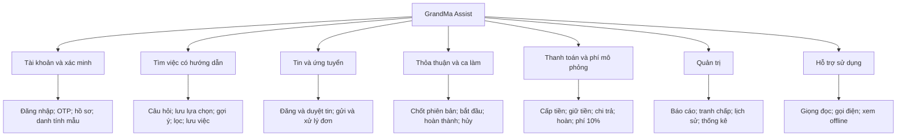
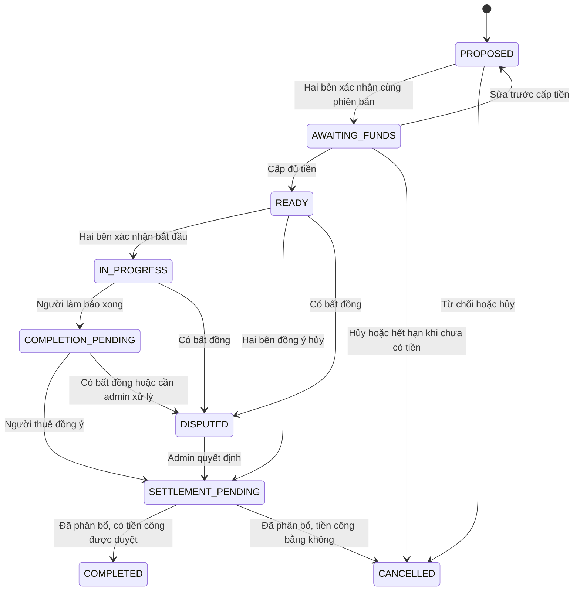
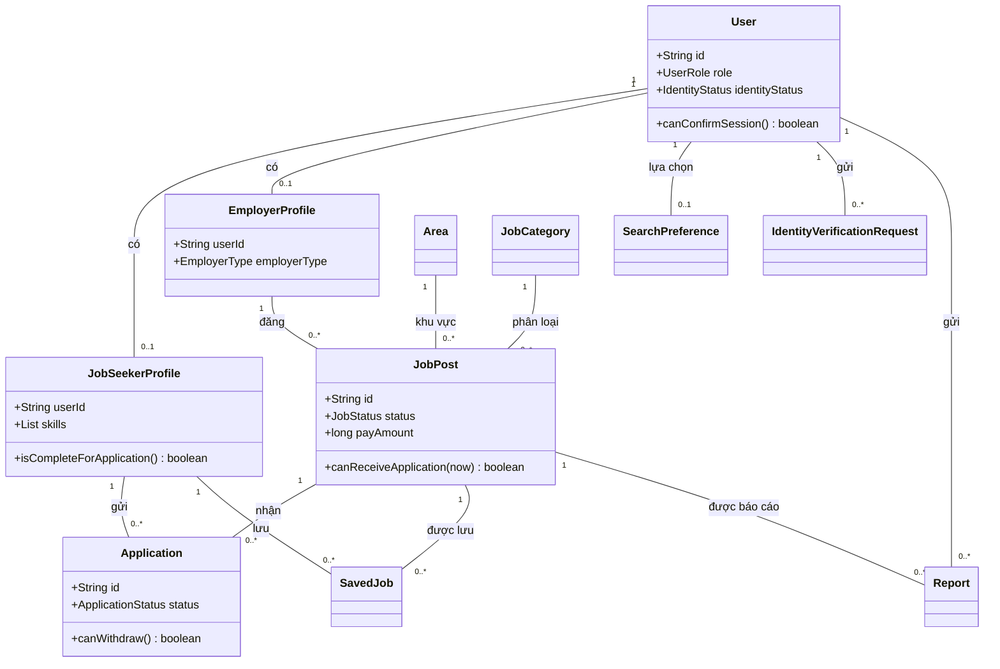
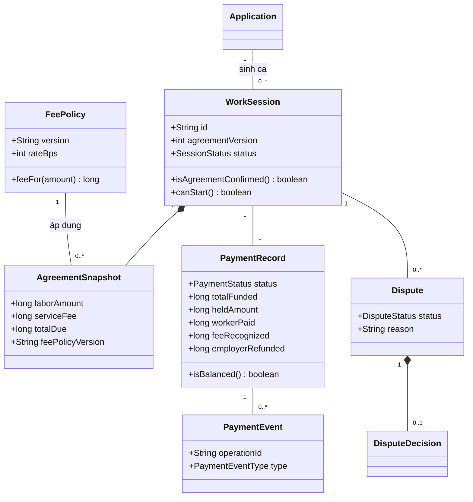
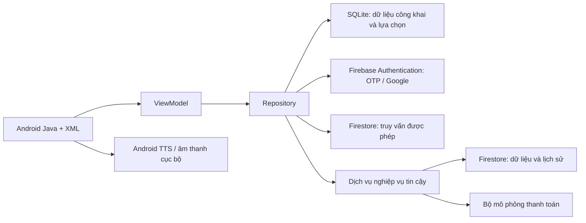
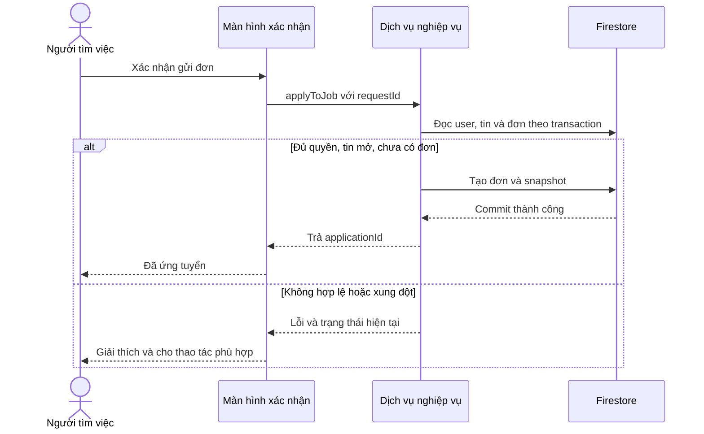
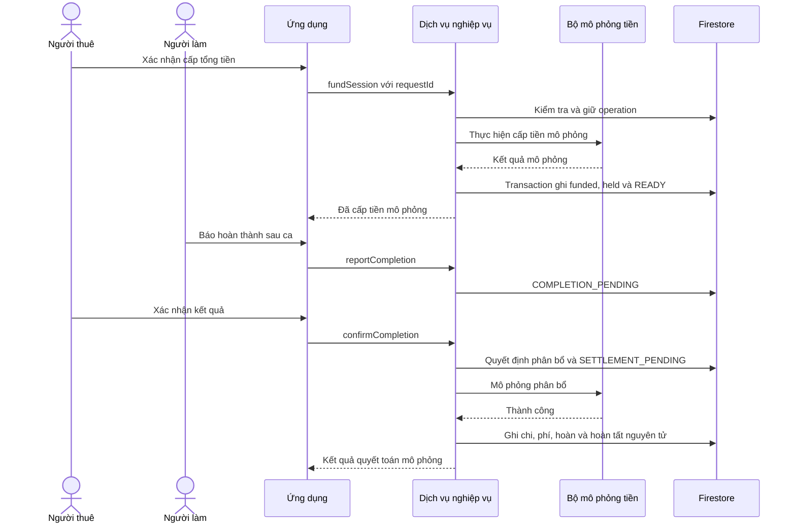

# GRANDMA ASSIST
## Bản phân tích và thiết kế hệ thống — phiên bản 2.0

**Ngày cập nhật:** 04/10/2026  
**Loại tài liệu:** Đặc tả phân tích và thiết kế cho đồ án phát triển ứng dụng mobile.  
**Phạm vi:** Android Java · Firebase · người nghỉ hưu · tìm việc có hướng dẫn · OTP thật · thanh toán mô phỏng theo ca.  
**Trạng thái:** Hợp nhất các quyết định đã được nhóm thống nhất; những tham số vận hành bổ sung được đánh dấu là đề xuất. Không bao gồm kế hoạch theo tuần, mã ứng dụng hay kết quả khảo sát/kiểm thử đã thực hiện.

> Điểm phân biệt bắt buộc: OTP thật xác minh khả năng sử dụng số điện thoại, không tự chứng minh danh tính theo căn cước. Xét duyệt danh tính bằng hồ sơ mẫu và mọi khoản tiền trong đồ án đều là mô phỏng.

## 1. Tóm tắt hệ thống và quyết định đã chốt

GrandMa Assist kết nối người nghỉ hưu muốn làm việc bán thời gian với cá nhân, gia đình và doanh nghiệp nhỏ cần thuê người làm. Hệ thống hướng dẫn người tìm việc lựa chọn từng bước, hỗ trợ chữ lớn và giọng đọc; quản lý từ tin tuyển dụng đến đơn ứng tuyển, thỏa thuận từng ca, kết quả làm việc và phân bổ tiền mô phỏng.

| Nội dung | Quyết định của bản thiết kế |
|---|---|
| Nền tảng | Android Studio; ứng dụng Android viết bằng Java, giao diện XML Views |
| SDK dự kiến | minSdk 29; compileSdk 36; targetSdk 36; chốt phiên bản thư viện tương thích khi triển khai |
| Backend và dữ liệu | Firebase Authentication, Cloud Firestore; lớp xử lý tin cậy cho nghiệp vụ nhạy cảm |
| Đăng nhập | Số điện thoại và Google; liên kết phương thức về cùng UID khi người dùng sử dụng cả hai |
| Xác minh số điện thoại | Firebase OTP SMS thật khi nghiệm thu; số kiểm thử trong phát triển |
| Danh tính | Quy trình admin xét duyệt hồ sơ mẫu, gắn nhãn mô phỏng; không tuyên bố đối chiếu dữ liệu nhà nước |
| Tìm việc | Hướng dẫn từng bước; gợi ý theo quy tắc và giải thích lý do phù hợp |
| Giao diện | Chữ lớn, ít lựa chọn chính, xanh lá đậm làm màu nhấn; chữ và nền phải đủ tương phản |
| Âm thanh | Hướng dẫn bằng giọng đọc, có bật/tắt, dừng và nghe lại; không điều khiển bằng giọng nói |
| Thiết bị | Điện thoại và tablet, màn hình dọc/ngang, vùng ứng dụng thay đổi kích thước |
| Ngoại tuyến | SQLite lưu nội dung việc đã xem và lựa chọn tìm việc; không quyết toán tiền hay xác minh khi offline |
| Đơn vị giao dịch | Mỗi ca/buổi có thời gian, nhiệm vụ, địa điểm và tiền công riêng |
| Thanh toán | Mô phỏng cấp tiền trước ca, giữ tiền, chi trả và hoàn tiền |
| Phí duy trì | Người thuê trả thêm 10% trên tiền công được công nhận; người làm không bị trừ phí nền tảng |
| Quản trị | Trong cùng ứng dụng: duyệt tin, hồ sơ mẫu, báo cáo, tranh chấp và thống kê phí |
| Ngoài phạm vi | Chat, tiền thật, eKYC/VNeID thật, AI, GPS tính khoảng cách, quảng cáo, gói hội viên, đánh giá sao |

**Điều kiện cần xác nhận với giảng viên:** OTP thật đáp ứng xác minh số điện thoại. Nếu tiêu chí “chính chủ” yêu cầu đối chiếu danh tính thật thì quy trình hồ sơ mẫu chưa đáp ứng tiêu chí đó; cần đổi phương thức xác minh. Đây là giới hạn của phạm vi hiện tại, không phải kết quả xác minh đã đạt.

## 2. Bài toán, mục tiêu và đối tượng

### 2.1. Vấn đề cần giải quyết

- Quá nhiều bộ lọc, biểu mẫu và thông tin có thể gây khó khăn cho người ít quen công nghệ.
- Người tìm việc cần biết công việc có phù hợp khu vực, thời gian và khả năng thực hiện của mình hay không.
- Người thuê cần thông tin ứng viên và cách ghi nhận thỏa thuận rõ ràng.
- Việc chỉ trao đổi số điện thoại không tạo được lịch sử ca làm, kết quả hoặc căn cứ phân bổ tiền.
- Hệ thống cần mô hình thu phí và theo dõi chi phí để giải thích khả năng duy trì.

### 2.2. Mục tiêu

1. Người dùng có thể tìm được danh sách việc phù hợp qua một chuỗi câu hỏi ngắn.
2. Mỗi thao tác chính có chỉ dẫn rõ, dùng được khi tăng cỡ chữ hoặc xoay thiết bị.
3. Tin tuyển dụng được kiểm duyệt; số liên hệ được xác minh; trạng thái xác minh không gây hiểu lầm.
4. Hai bên xác nhận cùng một phiên bản thỏa thuận trước khi ca được cấp tiền.
5. Mỗi khoản tiền mô phỏng có lịch sử, không bị ghi nhận hai lần và có thể đối chiếu tổng phân bổ.
6. Xem lại nội dung đã tải khi mất mạng.

### 2.3. Đối tượng và giới hạn

| Đối tượng | Nhu cầu thiết kế |
|---|---|
| Người tìm việc khoảng 55–65+ tuổi | Hạn chế gõ dài; chữ dễ đọc; lựa chọn từng bước; công việc phù hợp và tiền công dễ hiểu |
| Cá nhân/gia đình tuyển dụng | Đăng tin, chọn ứng viên, lập thỏa thuận và theo dõi từng ca |
| Doanh nghiệp nhỏ | Tương tự người thuê cá nhân; thông tin đơn vị tự khai báo, chưa xác minh tư cách đại diện doanh nghiệp |
| Admin | Hàng đợi việc cần xử lý, lý do quyết định, lịch sử nghiệp vụ |

Độ tuổi là định hướng thiết kế, không tự đặt thành điều kiện cấm đăng ký. Không mặc định mọi người lớn tuổi đều ít kỹ năng công nghệ: luôn có đường truy cập nhanh cho người đã quen. Các giả định trải nghiệm cần được kiểm chứng bằng khảo sát và thử nghiệm, không ghi trong báo cáo như dữ liệu nghiên cứu đã thu thập.

## 3. Thuật ngữ và ranh giới hệ thống

| Thuật ngữ | Định nghĩa |
|---|---|
| Tin tuyển dụng — JobPost | Nhu cầu tìm người làm; có thể nhận nhiều đơn |
| Đơn ứng tuyển — Application | Đề nghị của một người tìm việc đối với một tin |
| Đơn được chấp nhận | Hai bên được kết nối; chưa có nghĩa đã chốt ca hoặc đã trả tiền |
| Ca làm — WorkSession | Một lần thực hiện cụ thể; chỉ có một người làm và một người thuê |
| Thỏa thuận — AgreementSnapshot | Phiên bản nhiệm vụ, địa điểm, lịch, tiền công và chính sách đã xác nhận cho một ca |
| Cấp tiền — Funding | Ghi nhận thanh toán mô phỏng đủ tiền công cộng phí dự kiến |
| Giữ tiền — Held amount | Phần tiền mô phỏng chưa được phân bổ; chưa là doanh thu |
| Quyết toán — Settlement | Chốt phần trả người làm, phí nền tảng và hoàn người thuê |
| Báo cáo tin — Report | Phản ánh nội dung tin, không phải tranh chấp tiền của ca |
| Tranh chấp — Dispute | Bất đồng về một ca làm, hủy ca hoặc phân bổ tiền |
| Xác minh điện thoại | Xác nhận nhận được OTP hoặc cơ chế xác minh hợp lệ của Firebase cho số liên hệ |
| Xét duyệt danh tính mô phỏng | Admin xử lý hồ sơ mẫu để minh họa quy trình; không chứng minh danh tính thật |

**Hệ thống ngoài:** Firebase Authentication và nhà cung cấp Google hỗ trợ đăng nhập; Android TTS cung cấp giọng đọc; trình quay số hỗ trợ gọi điện. Cổng thanh toán và nhà cung cấp eKYC thật không nằm trong bản đầu.

## 4. Tác nhân và phân quyền nghiệp vụ

### 4.1. Tác nhân

- **Khách:** xem việc, sử dụng luồng gợi ý, xem dữ liệu công khai.
- **Người tìm việc — SEEKER:** quản lý hồ sơ, ứng tuyển, xác nhận ca, báo hoàn thành, xem tiền công và gửi tranh chấp.
- **Người thuê — EMPLOYER:** đăng tin, chọn ứng viên, đề xuất ca, cấp tiền mô phỏng, xác nhận kết quả.
- **Admin — ADMIN:** kiểm duyệt và xử lý nghiệp vụ được giao; không tự động có quyền sửa mọi dữ liệu.
- **Dịch vụ hệ thống:** xác minh thông tin tin cậy, xử lý giao dịch, thời hạn và ghi lịch sử; không phải tài khoản người dùng.

Mỗi tài khoản thông thường có một vai trò cố định trong bản đầu. Admin được cấp riêng; người dùng không thể tự chọn admin.

### 4.2. Quyền theo mức xác minh

| Mức | Người tìm việc | Người thuê |
|---|---|---|
| Khách | Xem việc và trả lời câu hỏi tìm việc | Xem nội dung công khai |
| Đăng nhập, chưa xác minh số liên hệ | Điền hồ sơ, lưu lựa chọn tìm việc | Điền hồ sơ, soạn nháp cục bộ |
| Số điện thoại đã xác minh, hồ sơ đủ | Lưu việc, ứng tuyển, rút đơn, báo cáo tin | Gửi tin duyệt, xử lý đơn |
| Hồ sơ danh tính mẫu được duyệt | Xác nhận thỏa thuận và tham gia ca mô phỏng | Lập/xác nhận ca và cấp tiền mô phỏng |

Giới hạn quyền giao dịch mới không được che lịch sử, chặn báo vấn đề hoặc làm mất khoản tiền đang chờ xử lý. Đổi thông tin quan trọng có thể yêu cầu xác minh lại, nhưng ca và số tiền đang tồn tại phải tiếp tục có đường xử lý hỗ trợ.

## 5. Yêu cầu chức năng và sơ đồ phân rã

### 5.1. Danh sách chức năng

| Mã | Nhóm | Yêu cầu |
|---|---|---|
| F01 | Tài khoản | Đăng nhập bằng số điện thoại/Google, đăng xuất |
| F02 | Tài khoản | Xác minh số liên hệ bằng OTP thật; liên kết phương thức đăng nhập |
| F03 | Tài khoản | Chọn vai trò lần đầu, cập nhật hồ sơ theo vai trò |
| F04 | Danh tính | Gửi hồ sơ mẫu, xem tiến độ, bổ sung và gửi lại |
| F05 | Danh tính | Admin duyệt/từ chối/yêu cầu bổ sung, lưu lý do |
| F06 | Tìm việc | Hỏi từng bước về loại việc, khu vực, thời gian và yêu cầu muốn tránh |
| F07 | Tìm việc | Lưu/sửa lựa chọn, gợi ý theo quy tắc, giải thích lý do phù hợp |
| F08 | Tìm việc | Xem tất cả, lọc, phân trang, xem chi tiết |
| F09 | Tìm việc | Lưu/bỏ lưu việc quan tâm |
| F10 | Ứng tuyển | Gửi đơn với snapshot hồ sơ và tin, không gửi trùng |
| F11 | Ứng tuyển | Xem trạng thái, rút đơn đang chờ |
| F12 | Tuyển dụng | Tạo/sửa/đóng tin và gửi kiểm duyệt |
| F13 | Tuyển dụng | Xem ứng viên, chấp nhận/từ chối đơn |
| F14 | Kiểm duyệt | Duyệt/từ chối/ẩn tin, có lý do theo quy tắc |
| F15 | Báo cáo | Gửi, xem và xử lý báo cáo tin |
| F16 | Ca làm | Đề xuất thỏa thuận, xem trước, sửa trước khi khóa |
| F17 | Ca làm | Hai bên xác nhận cùng phiên bản thỏa thuận |
| F18 | Ca làm | Ghi nhận bắt đầu, báo hoàn thành và xác nhận kết quả |
| F19 | Ca làm | Yêu cầu hủy, đồng ý hủy hoặc chuyển tranh chấp |
| F20 | Thanh toán | Tính phí 10% từ người thuê và hiển thị tổng trước xác nhận |
| F21 | Thanh toán | Cấp/giữ tiền mô phỏng; theo dõi kết quả giao dịch |
| F22 | Thanh toán | Chi trả, hoàn tiền, ghi nhận phí và lịch sử mô phỏng |
| F23 | Tranh chấp | Gửi vấn đề, cung cấp giải trình, admin chốt phân bổ |
| F24 | Liên hệ | Mở trình quay số từ thông tin được phép xem |
| F25 | Tiếp cận | Giọng đọc theo yêu cầu, bật/tắt, dừng, nghe lại |
| F26 | Ngoại tuyến | Lưu/xem lại tin đã tải; lưu câu trả lời hướng dẫn |
| F27 | Quản trị | Hàng đợi quá hạn, hồ sơ, báo cáo, tranh chấp |
| F28 | Thống kê | Tổng tiền cấp, tiền đang giữ, đã chi/hoàn, doanh thu phí mô phỏng |

### 5.2. Sơ đồ phân rã chức năng

<!-- diagram:functions -->



Responsive, bảo mật và khả năng đọc là yêu cầu phi chức năng, không phải các nghiệp vụ độc lập trong sơ đồ use case.

## 6. Thiết kế trải nghiệm cho người lớn tuổi

### 6.1. Trang chính người tìm việc

Thứ tự ưu tiên: (1) việc cần xử lý ngay nếu có; (2) nút lớn **Giúp tôi tìm việc**; (3) **Việc của tôi**; (4) **Nghe hướng dẫn/Trợ giúp**. Khi chưa có ca hoặc yêu cầu xác nhận, nút tìm việc là nội dung nổi bật nhất.

Mục **Thêm** chứa hồ sơ, việc đã lưu và cài đặt. Không giấu ca sắp tới, tiền công đang xử lý hoặc hỗ trợ vào menu khó phát hiện. **Việc của tôi** gom đơn ứng tuyển, ca làm và trạng thái tiền của từng ca, không yêu cầu người dùng hiểu một ví tiền riêng.

### 6.2. Luồng tìm việc từng bước

| Bước | Nội dung hiển thị | Dữ liệu |
|---|---|---|
| 1 | Cô/chú muốn làm việc gì? | Chọn một/nhiều categoryId; có Xem thêm và Chưa có ưu tiên |
| 2 | Cô/chú muốn làm ở khu vực nào? | Một/nhiều areaCode; gợi ý từ hồ sơ; cho bỏ qua |
| 3 | Cô/chú rảnh lúc nào? | Ngày trong tuần và ca sáng/chiều/tối; cho Linh hoạt |
| 4 | Cô/chú muốn tránh yêu cầu nào? | Mang vác nặng, đứng lâu, di chuyển nhiều; Không có yêu cầu riêng |
| Kết thúc | Tóm tắt lựa chọn và Xem việc phù hợp | Cho sửa từng bước, không phải làm lại từ đầu |

Một màn hình tập trung một câu hỏi; hiển thị Bước 1/4 và các nút Quay lại/Tiếp tục. Các lựa chọn “không có ưu tiên” loại trừ lựa chọn cụ thể tương ứng. Giữ câu trả lời khi quay lại hoặc xoay màn hình. Lần sau cho chọn **Dùng lựa chọn lần trước** hoặc **Thay đổi lựa chọn**. Có lối **Xem tất cả việc**.

Nguyên tắc chia nhóm câu hỏi, chỉ báo tiến trình và cho bỏ qua phần tùy chọn được tham khảo từ hướng dẫn biểu mẫu nhiều bước của W3C; cần kiểm thử lại trong bối cảnh ứng dụng Android và người dùng của nhóm. [S6]

Không hỏi thông tin bệnh tật. Các yêu cầu tránh phản ánh mong muốn người dùng, không phải kết luận y tế. Nhóm cần thử nghiệm cách xưng hô “cô/chú” với người dùng; nội dung phải nhất quán và có thể điều chỉnh.

### 6.3. Quy tắc gợi ý

**Tập ứng viên:** tin OPEN, chưa hết hạn, qua kiểm duyệt; lọc trên dữ liệu có cấu trúc.

**Điều kiện bắt buộc:** nếu có chọn khu vực thì chỉ nhận tin trong khu vực đó; lịch cố định phải nằm trong khoảng người dùng khai rảnh; loại các tin có yêu cầu người dùng muốn tránh. Tin thiếu mô tả yêu cầu thể lực không được xem như không có yêu cầu. Ca FLEXIBLE hoặc lịch chưa cụ thể hiển thị “Cần trao đổi lịch”, không khẳng định khớp hoàn toàn.

**Xếp hạng đề xuất:** cộng điểm cho danh mục được chọn, lịch khớp cụ thể và kỹ năng đã khai; hòa điểm thì ưu tiên tin mới. Trọng số ban đầu 50/30/20 là tham số thiết kế, không phải kết quả nghiên cứu. Nếu người dùng không khai một tiêu chí thì không trừ điểm do thiếu thông tin. Không hiển thị phần trăm phù hợp như một xác suất khoa học.

**Giải thích:** “Đúng khu vực đã chọn”, “Làm buổi sáng”, “Không yêu cầu mang vác nặng theo người đăng”. Không nói “cách nhà 2 km” vì chưa dùng GPS; không gợi ý “an toàn sức khỏe”.

**Không có kết quả:** nói rõ chưa có tin phù hợp; đề nghị nới một lựa chọn, người dùng phải đồng ý. Không tự bỏ điều kiện tránh. Kết quả offline chỉ xếp hạng trên tin đã tải; ghi rõ phạm vi. Trực tuyến cần lọc/tính thứ tự trên tập ứng viên hợp lệ trước khi phân trang, không gọi vài tin đầu tải về là “phù hợp nhất toàn hệ thống”.

### 6.4. Hình thức và âm thanh

- Giá trị khởi đầu để thử nghiệm: chữ nội dung 20sp, tiêu đề 26–28sp, vùng nút chính cao tối thiểu khoảng 56dp và được giãn theo chữ. Đây là đề xuất giao diện, không bảo đảm mọi người dùng đều phù hợp.
- Dùng xanh lá đậm làm màu nhấn, nền sáng, chữ tối; đặt mục tiêu tương phản chữ tối thiểu 4,5:1. Không dùng màu làm dấu hiệu duy nhất. [S7]
- Không cố định chiều cao khối văn bản; hỗ trợ font hệ thống lớn, TalkBack, thứ tự focus hợp lý và nhãn cho biểu tượng.
- Nút Nghe hướng dẫn, Dừng, Nghe lại luôn ở vị trí nhất quán. Mặc định không tự phát; người dùng có thể bật tự đọc các bước sau. Không phát nhạc nền.
- Có thể dùng TTS cho nội dung động, bản thu âm cục bộ cho câu hướng dẫn cố định. Giọng tiếng Việt và hỗ trợ offline cần kiểm tra trên thiết bị. [S8]
- Không đọc OTP hoặc dữ liệu liên hệ tự động. Khi đổi màn hình, dừng câu cũ; xoay màn hình không tự phát lại hoặc phát chồng. Tránh nói chồng TalkBack. Âm thanh không thay thế thao tác xác nhận.

## 7. Yêu cầu responsive và ngoại tuyến

### 7.1. Responsive/adaptive

| Không gian | Bố cục |
|---|---|
| Hẹp, điện thoại dọc | Một cột, một câu hỏi, nút chính dễ chạm |
| Điện thoại ngang | Cuộn được khi chiều cao thấp; lựa chọn có thể hai cột nếu đủ chỗ |
| Tablet | Giới hạn chiều rộng dòng chữ, không kéo nút hết màn hình |
| Vùng rộng | Kết quả việc có thể danh sách bên trái và chi tiết bên phải |
| Chia đôi cửa sổ | Chuyển bố cục theo chiều rộng hiện có, không theo tên loại thiết bị |

Điểm ngắt đề xuất cho vùng hiển thị là dưới 600dp, 600–839dp và từ 840dp trở lên; kiểm chứng lại với font lớn và chiều cao thực tế. Dù tablet rộng, luồng hướng dẫn vẫn giữ một câu hỏi chính mỗi bước. Dùng ViewModel và trạng thái được lưu để giữ lựa chọn, vị trí và nội dung form khi thay đổi cấu hình; không khởi động giao dịch từ hàm vẽ màn hình. Xử lý khoảng an toàn thanh hệ thống và bàn phím. [S5]

### 7.2. Phạm vi offline

| Được phép khi offline | Cần có mạng |
|---|---|
| Xem bản sao tin đã tải, danh mục và khu vực | OTP, liên kết/đổi số liên hệ |
| Trả lời và lưu lựa chọn tìm việc cục bộ | Gửi/rút đơn; tạo/sửa/duyệt tin |
| Nghe bản ghi âm hoặc giọng TTS có dữ liệu offline | Thay đổi lưu việc trên tài khoản |
| Soạn nháp form chưa gửi | Xác nhận ca, bắt đầu/kết thúc, thanh toán, tranh chấp |

SQLite lưu CachedJob, CachedCategory, CachedArea, CachedSavedJob và LocalSearchPreference. Mỗi bản ghi cần cachedAt; dữ liệu theo tài khoản cần ownerUid. Không lưu hồ sơ căn cước, snapshot đơn, địa chỉ riêng của ca, OTP hoặc token trong các bảng này. Hồ sơ thanh toán và thông tin danh tính không được trình bày là dữ liệu mới khi chỉ có cache.

Firestore Android có cơ chế offline riêng, không thay thế phần SQLite nhóm chủ động thiết kế. Để tránh lưu ngầm tài liệu riêng xuống đĩa, cấu hình Firestore dùng bộ nhớ cache không bền cho bản triển khai này; SQLite chỉ chứa dữ liệu được cho phép. Firebase Authentication quản lý phiên theo cơ chế SDK riêng. [S3]

Khi online: đọc nguồn từ dịch vụ, cập nhật cache và giao diện. Tin đã ẩn/đóng phải được kiểm tra lại bằng nguồn server hoặc endpoint trạng thái; không dùng kết quả từ cache làm bằng chứng tin còn mở. Khi offline chưa thể biết tin vừa bị gỡ: hiển thị nhãn dữ liệu cũ, không cho ứng tuyển. Khi đăng xuất, xóa cache theo tài khoản và dữ liệu nhạy cảm trong bộ nhớ.

## 8. Danh sách Use Case và hướng dẫn vẽ

### 8.1. Danh mục

| Mã | Use case | Tác nhân chính |
|---|---|---|
| UC01 | Đăng nhập/đăng xuất | Người dùng |
| UC02 | Xác minh số liên hệ/liên kết tài khoản | Người dùng |
| UC03 | Thiết lập vai trò và hồ sơ | Người tìm việc, người thuê |
| UC04 | Gửi/bổ sung hồ sơ danh tính mẫu | Người tìm việc, người thuê |
| UC05 | Xét duyệt hồ sơ mẫu | Admin |
| UC06 | Tìm việc có hướng dẫn | Khách, người tìm việc |
| UC07 | Xem/lọc danh sách và xem chi tiết | Khách, người tìm việc |
| UC08 | Lưu/bỏ lưu việc | Người tìm việc |
| UC09 | Gửi đơn ứng tuyển | Người tìm việc |
| UC10 | Theo dõi/rút đơn | Người tìm việc |
| UC11 | Đăng/sửa/gửi tin duyệt | Người thuê |
| UC12 | Đóng tin | Người thuê |
| UC13 | Duyệt/từ chối/ẩn tin | Admin |
| UC14 | Xem và xử lý ứng viên | Người thuê |
| UC15 | Báo cáo tin | Người tìm việc |
| UC16 | Xử lý báo cáo | Admin |
| UC17 | Đề xuất/sửa thỏa thuận ca | Người thuê |
| UC18 | Xác nhận/từ chối thỏa thuận | Hai bên |
| UC19 | Cấp tiền mô phỏng cho ca | Người thuê |
| UC20 | Ghi nhận bắt đầu ca | Hai bên |
| UC21 | Báo hoàn thành | Người làm |
| UC22 | Xác nhận kết quả/đề nghị xử lý | Người thuê |
| UC23 | Yêu cầu và xác nhận hủy ca | Hai bên |
| UC24 | Gửi/trao đổi tranh chấp | Hai bên |
| UC25 | Xử lý tranh chấp | Admin |
| UC26 | Quyết toán và xem lịch sử tiền | Dịch vụ hệ thống; hai bên xem |
| UC27 | Liên hệ bằng điện thoại | Hai bên theo quyền |
| UC28 | Nghe hướng dẫn/cài đặt hỗ trợ | Người dùng |
| UC29 | Xem lại khi offline | Người dùng |
| UC30 | Xem hàng đợi và thống kê vận hành | Admin |

### 8.2. Biểu diễn UML

Vẽ biên **GrandMa Assist**; tác nhân ở ngoài, use case hình ellipse ở trong. Có tác nhân tổng quát Người dùng đã đăng nhập và chuyên biệt SEEKER, EMPLOYER, ADMIN khi cần giảm đường nối. Firebase Authentication là tác nhân hỗ trợ UC01–UC02; Android TTS hỗ trợ UC28; cổng thanh toán thật không xuất hiện như một tích hợp đã có.

“Đã đăng nhập”, “đã xác minh” thường là tiền điều kiện; không nối include đến đăng nhập từ mọi nghiệp vụ. Không nối use case bằng mũi tên để biểu diễn thứ tự bước. Nếu cần include: UC19 bao gồm kiểm tra tổng tiền và ghi nhận cấp tiền; UC26 bao gồm tính phân bổ theo chính sách đã chốt. Các xử lý nội bộ này có thể chỉ ghi trong đặc tả để sơ đồ gọn.

Nên vẽ ba sơ đồ con: (a) Tài khoản và tìm việc; (b) Tuyển dụng và ca làm; (c) Quản trị và thanh toán. Bộ nguồn đi kèm cung cấp sơ đồ tổng quan chọn các use case chính; bảng trên là danh sách đầy đủ.

<!-- diagram:usecases -->

### 8.3. Đặc tả các use case trọng tâm

#### UC02 — Xác minh số liên hệ

- **Tiền điều kiện:** có mạng; người dùng đồng ý cung cấp số cho cơ chế xác thực; số được chuẩn hóa E.164, xử lý +84 đúng, không ghép thành +840…
- **Luồng chính:** nhập số → xem lại số → yêu cầu OTP → nhận/nhập mã hoặc SDK xác minh hợp lệ → Firebase trả credential → đăng nhập hoặc liên kết vào UID hiện tại → dịch vụ ghi nhận số liên hệ đã xác minh từ nguồn Auth tin cậy.
- **Ngoại lệ:** mã sai/hết hạn, gửi lại quá nhiều, mất mạng, số đã gắn tài khoản khác, liên kết thất bại. Không tự hợp nhất tài khoản chỉ dựa trên số hoặc email trùng; cần chứng minh quyền truy cập tài khoản liên quan.
- **Hậu điều kiện:** có kết quả xác minh số liên hệ, chưa tự đổi trạng thái danh tính.
- **Đổi số:** yêu cầu xác thực lại tài khoản, xác minh số mới; nếu không còn truy cập phương thức cũ thì vào quy trình hỗ trợ, không cấp quyền chỉ vì người mới nhận OTP của số tái sử dụng.

#### UC04–UC05 — Xét duyệt danh tính mẫu

- **Tiền điều kiện:** đã đăng nhập và xác minh số liên hệ. Chỉ dùng dữ liệu mẫu gắn nhãn DEMO.
- **Luồng:** giải thích mục đích → chọn/cung cấp hồ sơ mẫu → xem lại → gửi SUBMITTED → admin kiểm tra → VERIFIED hoặc NEEDS_INFO/REJECTED với lý do.
- **Ngoại lệ:** hồ sơ thiếu, hai admin xử lý đồng thời, người dùng sửa dữ liệu lúc đang xét. Mỗi lần bổ sung tạo phiên bản/yêu cầu mới, giữ lịch sử cũ.
- **Hậu điều kiện:** nhãn “Hồ sơ mẫu đã được duyệt — mô phỏng”; không hiển thị “đã xác minh bởi cơ quan nhà nước”.
- **Giới hạn:** xác minh người đại diện không tự xác minh doanh nghiệp; chưa có eKYC, liveness hoặc truy vấn căn cước thật.

#### UC06 — Tìm việc có hướng dẫn

- **Tiền điều kiện:** không bắt đăng nhập.
- **Luồng:** trả lời bốn bước → xem tóm tắt → áp dụng điều kiện → xếp hạng → xem danh sách và lý do phù hợp → mở chi tiết.
- **Ngoại lệ:** không có kết quả; thiếu dữ liệu; offline chỉ có cache; quay lại sửa câu trả lời. Không tự nới điều kiện cứng.
- **Hậu điều kiện:** lựa chọn được giữ cục bộ; khi đăng nhập có thể đồng bộ theo sự lựa chọn của người dùng, không ghi đè âm thầm lựa chọn đã có.

#### UC11–UC13 — Đăng và duyệt tin

- **Tiền điều kiện gửi tin:** người thuê đã xác minh số, hồ sơ đủ, có mạng.
- **Luồng:** nhập nội dung cấu trúc → xem trước → gửi PENDING_REVIEW → admin đọc → OPEN hoặc REJECTED kèm lý do.
- **Kiểm tra:** tiêu đề/nhiệm vụ rõ; danh mục/khu vực hợp lệ; tiền công dương; thời hạn tương lai; lịch và yêu cầu thể lực được khai rõ.
- **Ngoại lệ:** tin hết hạn trước lúc duyệt; thiếu trường; người khác sửa; tài khoản không có quyền. Dùng version để tránh duyệt nhầm nội dung mới.
- **Hậu điều kiện:** chỉ bản đã duyệt được công khai. Sửa tin OPEN làm nó quay lại chờ duyệt; snapshot đơn và thỏa thuận cũ không bị đổi.

#### UC09 — Gửi đơn ứng tuyển

- **Tiền điều kiện:** SEEKER, hồ sơ đủ, số liên hệ đã xác minh; chưa bắt buộc duyệt danh tính mẫu ở bước này.
- **Luồng:** xem thông tin sẽ gửi → lời nhắn tùy chọn → đồng ý chia sẻ số với chủ tin → xác nhận → kiểm tra tin OPEN/chưa hết hạn và chưa có đơn → tạo PENDING cùng snapshot.
- **Ngoại lệ:** trùng đơn, tin vừa đóng/ẩn, hết hạn, mất mạng. ID duy nhất cho cặp jobId–seekerId và transaction ngăn gửi trùng.
- **Hậu điều kiện:** đúng một đơn được tạo sau xác nhận thành công; thất bại không tạo đơn giả trong giao diện.

#### UC10/UC14 — Rút và xử lý đơn

- Người gửi chỉ rút PENDING; chủ tin chỉ chấp nhận/từ chối PENDING của tin mình.
- Tin OPEN/CLOSED cho xử lý đơn đã có; PENDING_REVIEW/REJECTED/HIDDEN không cho xử lý đơn chờ.
- Khi chấp nhận, chia sẻ snapshot liên hệ chủ tin với ứng viên. Chủ tin đã đọc số ứng viên theo đồng ý khi nộp đơn.
- Nếu rút và chấp nhận đồng thời, chỉ một chuyển trạng thái thắng; thao tác còn lại nhận trạng thái mới, không ghi đè.
- ACCEPTED không tự tạo ca, không tự thu tiền; không cho gửi lại cùng tin sau trạng thái cuối trong bản đầu.

#### UC17–UC18 — Chốt thỏa thuận ca

- **Tiền điều kiện:** đơn ACCEPTED; cả hai đủ hồ sơ và danh tính mẫu đã được duyệt; tài khoản hoạt động; tin không HIDDEN. Tin CLOSED hoặc hết hạn nhận đơn vẫn cho lập ca từ quan hệ đã được chấp nhận.
- **Luồng:** người thuê đề xuất nhiệm vụ, địa điểm riêng, thời gian, tiền công → hệ thống tính phí và tổng → người thuê xác nhận gửi phiên bản → người làm xem tiền mình nhận và điều kiện → xác nhận đúng phiên bản → AWAITING_FUNDS.
- **Sửa trước cấp tiền:** tạo version mới, xóa hiệu lực cả hai xác nhận cũ, quay về PROPOSED. Khi đã cấp tiền, bản đầu không sửa trực tiếp; dùng hủy có thỏa thuận hoặc tạo ca bổ sung riêng.
- **Ngoại lệ:** lịch không hợp lệ/trùng ca READY hoặc IN_PROGRESS của người làm; trạng thái xác minh thay đổi; xác nhận phiên bản cũ; số tiền vượt giới hạn cấu hình.
- **Hậu điều kiện:** khóa snapshot và feePolicyVersion đã được cả hai xác nhận.

#### UC19 — Cấp tiền mô phỏng

- **Tiền điều kiện:** người thuê của ca, ca AWAITING_FUNDS, chưa quá hạn, version hiện tại được hai bên xác nhận.
- **Luồng:** hiển thị tiền công + phí → xác nhận mô phỏng → backend kiểm tra → SimulatedPaymentGateway trả kết quả → ghi sự kiện và số tiền giữ → ca READY.
- **Ngoại lệ:** giao dịch thất bại/đang xử lý, double tap, mất phản hồi, request cũ. Client không được tự viết funded=true. Retry cùng requestId trả kết quả cũ thay vì cấp tiền lần hai.
- **Hậu điều kiện:** READY chỉ khi đủ toàn bộ tổng tiền; đang xử lý chưa được bắt đầu ca.

#### UC20–UC22 — Bắt đầu và hoàn thành

- **Bắt đầu:** ca READY, đủ tiền và tới khoảng thời gian cho phép; hai bên xác nhận bắt đầu. Lưu thời điểm từng xác nhận, chuyển IN_PROGRESS khi đủ hai bên. Thiếu xác nhận thì cần hỗ trợ, không coi một nút bấm là bằng chứng tuyệt đối.
- **Kết thúc:** người làm báo xong → COMPLETION_PENDING → người thuê xác nhận hoặc mở tranh chấp. Xác nhận đồng ý tạo quyết định phân bổ và yêu cầu quyết toán.
- **Không phản hồi:** sau 24 giờ đề xuất, đánh dấu quá hạn, chuyển hàng đợi admin; không tự trả tiền chỉ vì hết thời gian. Admin xử lý theo quy trình có bằng chứng và lý do.
- **Ngoại lệ:** mất mạng, sai trạng thái, hai thao tác đồng thời. Không gửi lệnh nghiệp vụ âm thầm từ hàng đợi offline.

#### UC23 — Hủy ca

- PROPOSED/AWAITING_FUNDS chưa có tiền: một trong hai bên có thể hủy hoặc từ chối; không phát sinh phí.
- READY đã có tiền và chưa bắt đầu: một bên yêu cầu hủy; bên còn lại đồng ý thì hoàn toàn bộ và phí bằng 0. Trong lúc yêu cầu hủy chờ xử lý, không bắt đầu ca.
- Không đồng ý, không phản hồi hoặc có bất đồng việc đã bắt đầu: mở tranh chấp, không tự hoàn.
- Khi funding đang xử lý, yêu cầu hủy phải được tuần tự hóa với kết quả funding: nếu funding thành công muộn, hoàn theo quy trình; không để ca hủy nhưng tiền bị bỏ quên.
- Đang làm thì dùng tranh chấp để xác định phần công việc đã hoàn thành; không áp chính sách hủy trước ca máy móc.

#### UC24–UC26 — Tranh chấp và quyết toán

- **Tiền điều kiện:** hai bên của ca có quyền gửi; tối đa một tranh chấp đang mở mỗi ca; ca chưa quyết toán cuối trong bản đầu.
- **Luồng:** nêu lý do → lưu thỏa thuận và lịch sử → nhận giải trình bên kia → admin xem → quyết định phần công được duyệt, phí và tiền hoàn → ghi lý do → thực thi phân bổ mô phỏng → đóng tranh chấp sau khi hoàn tất.
- **Nguyên tắc:** admin không tự quyết vụ liên quan tài khoản của mình; không dùng kiểm duyệt tin thay cho giải quyết tranh chấp; hệ thống kiểm tra tổng số tiền, không tin phép tính client.
- **Hậu điều kiện:** tiền chi + phí ghi nhận + hoàn + tiền còn giữ bằng tổng đã cấp; có lịch sử bất biến. Nếu thao tác thất bại, vẫn có trạng thái cần xử lý, không báo thành công.
- **Giới hạn:** chưa xử lý tranh chấp mở mới sau quyết toán cuối/chargeback thật. Báo cáo vận hành sau quyết toán vẫn được tiếp nhận để hỗ trợ nhưng không tự đảo tiền.

## 9. Quy tắc nghiệp vụ thống nhất

| Mã | Quy tắc bắt buộc |
|---|---|
| BR01 | Vai trò do cơ chế tin cậy cấp; không cho tự nâng quyền admin |
| BR02 | Một số liên hệ đã xác minh chỉ gắn với một tài khoản đang sử dụng trong bản đầu; số điện thoại không phải bằng chứng một người chỉ có một tài khoản |
| BR03 | OTP thật, OTP kiểm thử và xét duyệt danh tính mẫu có nhãn khác nhau |
| BR04 | Số liên hệ chia sẻ phải là số đã xác minh, không phải trường điện thoại tùy ý trong hồ sơ |
| BR05 | SEEKER/EMPLOYER chỉ chỉnh hồ sơ của mình; thay đổi dữ liệu định danh cốt lõi yêu cầu xét lại |
| BR06 | Tin chỉ nhận đơn khi OPEN, chưa hết hạn và chủ tin còn quyền hoạt động |
| BR07 | Sửa tin đã duyệt làm tin trở về PENDING_REVIEW; lưu version |
| BR08 | Người thuê chỉ sửa/đóng tin của mình; admin chỉ xử lý trường kiểm duyệt được phép |
| BR09 | Mỗi cặp người tìm việc–tin có tối đa một đơn; chưa gửi lại sau rút/từ chối |
| BR10 | Chỉ PENDING được rút/chấp nhận/từ chối; chuyển trạng thái phải kiểm tra lại trên server |
| BR11 | Không xóa đơn hoặc tin để làm mất lịch sử nghiệp vụ |
| BR12 | Một đơn ACCEPTED có thể có nhiều ca; mỗi ca độc lập về thỏa thuận, thời gian và tiền |
| BR13 | Mỗi ca chỉ có một người làm và một người thuê; nhiều người làm phải là các ca riêng |
| BR14 | Cả hai bên phải đủ mức xác minh của bản demo trước khi xác nhận ca mới |
| BR15 | Hai bên xác nhận cùng agreementVersion; đổi nội dung trước cấp tiền làm mất hiệu lực xác nhận cũ |
| BR16 | Ca đã cấp tiền không được sửa âm thầm tiền công/nhiệm vụ/thời gian/địa điểm |
| BR17 | Tổng tiền cần cấp bằng tiền công cộng phí 10%; không khấu trừ phí vào tiền công người làm |
| BR18 | Chỉ READY với đủ tiền và không có yêu cầu hủy/tranh chấp chờ mới được bắt đầu |
| BR19 | Tiền đang giữ không được tính là doanh thu phí |
| BR20 | Ca hoàn thành đầy đủ thu 10%; phần hoàn thành được công nhận thu 10% phần đó |
| BR21 | Ca hủy chưa thực hiện và đủ điều kiện hoàn toàn bộ không thu phí |
| BR22 | Không tính phí trên tiền hoàn, bồi thường hoặc các khoản ngoài tiền công |
| BR23 | Phí áp dụng theo snapshot chính sách của ca, không áp ngược cấu hình mới |
| BR24 | Một request nghiệp vụ có requestId; retry không tạo kết quả tài chính thứ hai |
| BR25 | Quyết toán phải bảo toàn tiền, số nguyên VND và không âm |
| BR26 | Chưa phản hồi không đồng nghĩa đồng ý; quá hạn chuyển hàng đợi admin |
| BR27 | Tin HIDDEN chặn đơn/ca mới; không xóa thỏa thuận, đơn hoặc tiền của các ca hiện có |
| BR28 | Cần dừng ca hiện có vì vi phạm phải có quyết định riêng và đường xử lý tiền, không chỉ đổi trạng thái tin |
| BR29 | Người dùng chỉ xem dữ liệu riêng thuộc quan hệ nghiệp vụ của mình; admin đọc đúng phạm vi cần xử lý |
| BR30 | Offline không được xác nhận nghiệp vụ nhạy cảm; không dùng đồng hồ thiết bị để quyết định hạn hay tiền |
| BR31 | Mở trình quay số không tự gọi; người dùng chủ động xác nhận cuộc gọi |
| BR32 | Không hiển thị “đã đảm bảo an toàn” chỉ từ kết quả duyệt tin, OTP hoặc hồ sơ mẫu |

## 10. Mô hình trạng thái

### 10.1. Tin và đơn

**JobStatus:** PENDING_REVIEW, OPEN, REJECTED, CLOSED, HIDDEN.

| Chuyển trạng thái | Ai thực hiện | Điều kiện |
|---|---|---|
| Tạo → PENDING_REVIEW | Người thuê | Đủ dữ liệu và quyền |
| PENDING_REVIEW → OPEN | Admin | Duyệt đúng version, còn hạn |
| PENDING_REVIEW → REJECTED | Admin | Có lý do |
| REJECTED → PENDING_REVIEW | Chủ tin | Sửa và gửi lại |
| OPEN → PENDING_REVIEW | Chủ tin | Sửa nội dung |
| OPEN → CLOSED | Chủ tin | Đóng nhận đơn mới |
| OPEN/CLOSED → HIDDEN | Admin | Có lý do, lưu lịch sử |

expiresAt là điều kiện riêng; OPEN nhưng quá hạn không nhận đơn. Không cần tự đổi sang trạng thái EXPIRED. Chưa hỗ trợ mở lại CLOSED/HIDDEN trong bản đầu; chủ tin có thể tạo tin mới qua kiểm duyệt. Soạn nháp là local, không phải trạng thái server của tin.

**ApplicationStatus:** PENDING → ACCEPTED / REJECTED / WITHDRAWN. Ba trạng thái cuối không đổi lại. ACCEPTED là liên kết để đề xuất ca, không phải trạng thái hoàn thành việc.

### 10.2. Ca làm

<!-- diagram:sessionState -->



Yêu cầu hủy chờ được lưu bằng CancelRequest, không ép ca sang CANCELLED trước khi hoàn tiền. COMPLETED có completionOutcome FULL/PARTIAL. Các lỗi giao dịch được giữ ở PaymentRecord, không tự đổi ca thành hoàn thành. Các terminal COMPLETED/CANCELLED chỉ được đặt khi tiền còn giữ bằng 0 hoặc chưa từng cấp tiền.

### 10.3. Thanh toán

**PaymentStatus:** UNFUNDED → FUNDING → HELD → SETTLING → SETTLED.

- Funding thất bại chắc chắn: trở lại UNFUNDED, lưu lỗi và sự kiện thất bại. Chưa biết kết quả: giữ FUNDING để đối chiếu, không cho cấp thêm một lần khác.
- Settlement thất bại trước áp dụng: trở lại HELD, ca vẫn SETTLEMENT_PENDING, có nút thử xử lý lại theo quyền. Chưa rõ kết quả: giữ SETTLING để đối chiếu.
- SETTLED nghĩa là toàn bộ tiền đã được phân bổ theo quyết định, có thể chi trả đầy đủ, hoàn toàn bộ hoặc kết hợp chi/hoàn; không đồng nghĩa luôn trả toàn bộ cho người làm.
- Trong bản mô phỏng, áp dụng các phần chi/hoàn/phí cùng transaction. Kịch bản lỗi xảy ra trước transaction hoặc trả lại kết quả đã ghi; không giả lập chuyển khoản thật từng phần.

**IdentityStatus:** NOT_SUBMITTED → SUBMITTED → VERIFIED / NEEDS_INFO / REJECTED; sửa định danh hoặc thu hồi quyết định → REVERIFY_REQUIRED. Gửi lại tạo request mới; trạng thái tóm tắt User được cập nhật từ request hợp lệ mới nhất.

**DisputeStatus:** OPEN → UNDER_REVIEW → DECIDED → RESOLVED; DECIDED có thể tồn tại trong lúc quyết toán thất bại. **ReportStatus:** OPEN → RESOLVED với resolution NO_VIOLATION/JOB_HIDDEN.

## 11. Chính sách tiền công, phí và duy trì hệ thống

### 11.1. Công thức

Gọi C là tiền công đã chốt, r = 10%, F(x) = làm tròn half-up(x × r) đến một đồng. Tất cả giá trị tiền là số nguyên VND, không dùng số thực dấu phẩy động để cộng tiền.

- Tổng phải cấp T = C + F(C).
- Hoàn thành đầy đủ: người làm nhận C; phí F(C); hoàn 0.
- Hoàn thành một phần được duyệt A, với 0 ≤ A ≤ C: người làm nhận A; phí F(A); hoàn T − A − F(A).
- Hủy đủ điều kiện hoàn toàn bộ: A = 0, phí = 0, hoàn T.
- Bất biến: **totalFunded = workerPaid + feeRecognized + employerRefunded + heldAmount**.

Một ca chỉ cấp tiền thành công một lần trong bản đầu. Không có nạp ví, rút ví hoặc top-up ca đã khóa. Nếu có phần việc bổ sung, tạo một ca bổ sung riêng được xác nhận và cấp tiền trước khi làm phần đó. Không cho tăng A vượt C khi quyết toán.

| Kịch bản ca 240.000đ | Đã cấp | Người làm | Phí | Hoàn | Còn giữ |
|---|---:|---:|---:|---:|---:|
| Vừa cấp tiền | 264.000 | 0 | 0 | 0 | 264.000 |
| Hoàn thành đủ | 264.000 | 240.000 | 24.000 | 0 | 0 |
| Duyệt một phần 120.000 | 264.000 | 120.000 | 12.000 | 132.000 | 0 |
| Hủy hoàn toàn bộ | 264.000 | 0 | 0 | 264.000 | 0 |

Trường hợp hủy/tranh chấp phải có lý do và kết quả được thông báo cho hai bên. Phí của phần việc được công nhận sau tranh chấp là chính sách GrandMa Assist, cần được nêu trước khi chốt ca.

### 11.2. Cách hiển thị

Người thuê thấy: “Tiền công người làm nhận: 240.000đ”; “Phí dịch vụ 10%: 24.000đ”; “Tổng: 264.000đ”. Người làm thấy nổi bật: “Tiền công của cô/chú: 240.000đ — không trừ phí nền tảng”. Mọi màn hình tiền có nhãn **Mô phỏng — không sử dụng tiền thật**.

Tổng phí phải được dự tính ngay khi nhập tiền công, không xuất hiện như phụ thu bất ngờ ở bước cuối. Không tự thay mức phí với thỏa thuận đã xác nhận. Bản đầu dùng policy GMA_FEE_V1, rateBps = 1000, payer = EMPLOYER, chưa có phí tối thiểu/trần/hội viên/khuyến mại.

### 11.3. Cơ sở tham khảo và giới hạn

bTaskee công bố trong tài liệu đối tác mức khấu trừ 20% theo giao dịch hoàn thành, có thể thay đổi; Taskrabbit mô tả phí tính cho khách ngoài đơn giá người làm; Airtasker ở Úc có phí đối tác và phí kết nối khách riêng. Đây là cơ sở tham khảo các cách thu, không chứng minh 10% là trung bình thị trường. [S9][S10][S11]

GrandMa Assist chọn người thuê chịu 10% để người nghỉ hưu nhìn thấy tiền công nhất quán. Thu phí tạo nguồn thu nhưng chưa chứng minh đủ duy trì. Chi phí cần theo dõi gồm hạ tầng, OTP, hỗ trợ, kiểm duyệt, xử lý tranh chấp, bảo trì; khi có tiền thật còn có phí xử lý thanh toán và các nghĩa vụ liên quan.

**Kịch bản minh họa, không phải báo giá:** tiền công bình quân 200.000đ, phí 20.000đ/ca; biến phí 5.000đ/ca; định phí 3.000.000đ/tháng. Điểm hòa vốn theo giả định = 3.000.000 / (20.000 − 5.000) = 200 ca/tháng. Nếu phí không lớn hơn biến phí thì không thể hòa vốn chỉ bằng tăng số ca. Chưa có dữ liệu thực tế về nhu cầu hay lợi nhuận.

Admin xem tách biệt: tổng giao dịch, tiền đang giữ, đã trả người làm, đã hoàn, phí đã ghi nhận và số ca quyết toán. Lợi nhuận không đồng nghĩa phí thu được; cần trừ chi phí. Mô hình duy trì còn cần sao lưu, kiểm thử phân quyền, kiểm soát chi phí OTP, giới hạn truy vấn và lịch sử xử lý.

## 12. Mô hình lớp nghiệp vụ và từ điển dữ liệu

### 12.1. Quy ước chung

- String là chuỗi; Long là số nguyên VND hoặc bộ đếm; Instant lưu timestamp server; LocalTime dùng cho lịch mẫu; dấu ? là trường tùy chọn.
- ID là giá trị không chứa dữ liệu riêng. Không dùng số điện thoại/căn cước làm document ID công khai.
- Mọi snapshot đã khóa giữ nguyên; thông tin hiện tại của hồ sơ không tự thay thế nội dung đã xác nhận.
- Dữ liệu thời gian sự kiện lưu UTC, hiển thị theo Asia/Ho_Chi_Minh cho bối cảnh Việt Nam; không quyết định hết hạn bằng giờ thiết bị.
- Các thuộc tính *By là UID/reference, *At là Instant; trường trạng thái dùng enum, không dùng chuỗi tiếng Việt tùy ý.

### 12.2. Tài khoản, hồ sơ và gợi ý

| Lớp | Thuộc tính chính | Trách nhiệm/phương thức |
|---|---|---|
| User | id, displayName, role, accountStatus, phoneE164?, phoneVerifiedAt?, phoneVerificationMode, identityStatus, identityMode, identityRequestId?, createdAt, updatedAt | canApply(), canConfirmSession(); kết quả cuối do backend kiểm tra |
| JobSeekerProfile | userId, areaCode, skills: List, experienceSummary, preferredShifts: List | isCompleteForApplication() |
| EmployerProfile | userId, employerType, organizationName?, introduction, areaCode | isCompleteForPosting() |
| SearchPreference | userId, categoryIds: List, areaCodes: List, availableDays: List, availableShifts: List, avoidedDemands: List, updatedAt | validate(), hasHardConstraints() |
| AccessibilitySettings | fontScaleOption, voiceEnabled, autoReadEnabled, speechRate | Value object cục bộ; không giảm cỡ chữ hệ thống |
| Area | code, name, parentCode?, active | Danh mục khu vực; quan hệ tự tham chiếu 0..1 cha |
| JobCategory | id, name, iconKey, active | Danh mục việc |
| IdentityVerificationRequest | id, userId, profileVersion, sampleEvidenceRefs: List, mode, status, submittedAt, reviewedBy?, reviewedAt?, reason? | canReview(); luôn mode DEMO trong bản này |

Số liên hệ không lặp dưới dạng có thể sửa tùy ý trong hai profile. Lấy từ User đã được đồng bộ với Firebase Auth để tạo contact snapshot. User là tài liệu riêng, không đọc công khai; public name/badge nếu cần dùng một bản chiếu chỉ chứa trường công khai.

### 12.3. Tin, đơn và báo cáo

| Lớp | Thuộc tính chính | Trách nhiệm/phương thức |
|---|---|---|
| JobPost | id, employerId, employerDisplayName, categoryId, areaCode, title, description, requirementsText, requiredSkillTags: List, workDays: List, workShift, scheduleText, physicalDemands: List, demandsDeclared, payAmount: Long, payUnit, status, version, expiresAt, createdAt, updatedAt, reviewedBy?, reviewedAt?, reviewReason? | isExpired(now), canReceiveApplication(now), validate() |
| Application | id, jobId, seekerId, employerId, message?, status, applicantSnapshot, jobSnapshot, employerContactSnapshot?, createdAt, updatedAt | canWithdraw(), canReview() |
| SavedJob | seekerId, jobId, savedAt | Liên kết duy nhất theo cặp |
| Report | id, reporterId, jobId, reason, detail?, status, resolution?, handledBy?, resolutionNote?, createdAt, resolvedAt? | isResolved() |
| ApplicantSnapshot | displayName, verifiedPhone, skills, experienceSummary, consentAt, profileVersion | Dữ liệu người gửi đồng ý chia sẻ khi ứng tuyển |
| JobSnapshot | title, categoryId, areaCode, scheduleText, physicalDemands, payAmount, payUnit, jobVersion | Điều kiện tin tại lúc nộp đơn |
| ContactSnapshot | displayName, verifiedPhone, sharedAt | Liên hệ chủ tin khi chấp nhận |

payUnit của tin có thể HOUR/SESSION/DAY. Tin là thông tin tham khảo; khi lập ca phải chốt tổng laborAmount cụ thể. Nếu tính từ đơn giá giờ thì hiển thị thời lượng và phép tính để hai bên xác nhận, không tự dùng số giờ GPS hoặc bộ đếm làm tiền cuối.

### 12.4. Ca, tiền và tranh chấp

| Lớp | Thuộc tính chính | Trách nhiệm/phương thức |
|---|---|---|
| WorkSession | id, applicationId, jobId, seekerId, employerId, agreement, agreementVersion, employerAcceptedVersion?, seekerAcceptedVersion?, status, cancellationRequest?, employerStartedAt?, seekerStartedAt?, completionReportedAt?, completionResponseDueAt?, completionOutcome?, createdAt, updatedAt | isAgreementConfirmed(), canStart(), canReportCompletion() |
| AgreementSnapshot | tasks, privateAddress, areaCode, startAt, endAt, laborAmount: Long, feeRateBps, serviceFee: Long, totalDue: Long, feePolicyVersion, cancellationPolicyVersion, fundingDeadline | Bản chốt có version; thay đổi tạo phiên bản mới trước funding |
| CancelRequest | requestedBy, reason, requestedAt, respondedBy?, respondedAt?, status | Value object; PENDING/ACCEPTED/REJECTED |
| FeePolicy | version, rateBps, payer, roundingMode, effectiveAt, active | feeFor(amount), quote(amount); không sửa policy đã được ca tham chiếu |
| PaymentRecord | sessionId, employerId, seekerId, mode, agreementVersion, status, expectedTotal, totalFunded, heldAmount, workerPaid, feeRecognized, employerRefunded, approvedLaborAmount?, lastOperationId?, lastError?, updatedAt | allocationFor(approvedAmount), isBalanced() |
| PaymentEvent | id, sessionId, operationId, type, status, fundingDelta, workerPaidDelta, feeDelta, refundDelta, actorId?, createdAt, errorCode? | Bất biến; chỉ sự kiện thành công thay đổi số tiền |
| Dispute | id, sessionId, openedBy?, openedByType: USER/SYSTEM, reason, description, status, responseDueAt, assignedAdminId?, decision?, createdAt, resolvedAt? | canRespond(), canResolve(); SYSTEM dùng khi chuyển quá hạn sang xử lý |
| DisputeDecision | approvedLaborAmount, computedFee, computedRefund, reason, decidedBy, decidedAt, version | Lý do quyết định; tiền tính theo FeePolicy snapshot |
| AuditEvent | id, entityType, entityId, action, actorId, requestId, previousVersion?, newVersion?, createdAt | Nhật ký thay đổi quan trọng; không chứa OTP/giấy tờ thô |

Dispute có các phản hồi bên trong subcollection Responses gồm id, authorId, message, createdAt. Bản đầu dùng giải trình chữ và lịch sử hệ thống; chưa bắt buộc tải ảnh nhà riêng hay ảnh người thật. Mỗi quyết định cần lý do; dữ liệu hiện có không được coi là chứng cứ tuyệt đối.

### 12.5. Enum

| Enum | Giá trị |
|---|---|
| UserRole | SEEKER, EMPLOYER, ADMIN |
| AccountStatus | ACTIVE, RESTRICTED |
| EmployerType | INDIVIDUAL, ORGANIZATION |
| WorkShift | MORNING, AFTERNOON, EVENING, FLEXIBLE |
| PhysicalDemand | HEAVY_LIFTING, PROLONGED_STANDING, FREQUENT_MOVEMENT |
| PayUnit | HOUR, SESSION, DAY |
| JobStatus | PENDING_REVIEW, OPEN, REJECTED, CLOSED, HIDDEN |
| ApplicationStatus | PENDING, ACCEPTED, REJECTED, WITHDRAWN |
| SessionStatus | PROPOSED, AWAITING_FUNDS, READY, IN_PROGRESS, COMPLETION_PENDING, DISPUTED, SETTLEMENT_PENDING, COMPLETED, CANCELLED |
| PaymentStatus | UNFUNDED, FUNDING, HELD, SETTLING, SETTLED |
| VerificationMode | REAL, TEST, DEMO; áp dụng phù hợp từng loại xác minh |
| IdentityStatus | NOT_SUBMITTED, SUBMITTED, NEEDS_INFO, VERIFIED, REJECTED, REVERIFY_REQUIRED |
| DisputeStatus | OPEN, UNDER_REVIEW, DECIDED, RESOLVED |
| ReportReason | MISLEADING, INAPPROPRIATE, SUSPECTED_SCAM, OTHER |
| ReportResolution | NO_VIOLATION, JOB_HIDDEN |
| PaymentEventType | FUNDING_SUCCEEDED, SETTLEMENT_SUCCEEDED, ATTEMPT_FAILED |

### 12.6. Quan hệ và bội số

| Quan hệ | Bội số và ràng buộc |
|---|---|
| User — JobSeekerProfile | 1 — 0..1, chỉ role SEEKER |
| User — EmployerProfile | 1 — 0..1, chỉ role EMPLOYER; hai profile loại trừ nhau |
| User — SearchPreference | 1 — 0..1; khách có bản local chưa gắn User |
| User — IdentityVerificationRequest | 1 — 0..*; tối đa một yêu cầu đang xét hiện hành |
| EmployerProfile — JobPost | 1 — 0..* |
| JobCategory/Area — JobPost | Mỗi tin thuộc 1 category và 1 area; danh mục có 0..* tin |
| JobPost — Application | 1 — 0..* |
| JobSeekerProfile — Application | 1 — 0..*; duy nhất cặp seekerId–jobId |
| JobSeekerProfile/JobPost — SavedJob | Mỗi SavedJob liên kết đúng 1 người và 1 tin |
| Application — WorkSession | 1 — 0..*; chỉ Application ACCEPTED |
| WorkSession — AgreementSnapshot | Composition 1 — 1 cho phiên bản hiện hành; lịch sử riêng |
| WorkSession — PaymentRecord | 1 — 1, tạo UNFUNDED khi tạo ca |
| PaymentRecord — PaymentEvent | 1 — 0..* |
| WorkSession — Dispute | 1 — 0..* về lịch sử, tối đa một tranh chấp hoạt động |
| FeePolicy — AgreementSnapshot | 1 — 0..*, theo version đã chốt |
| User — Report; JobPost — Report | Mỗi report có 1 người gửi và 1 tin; mỗi bên có 0..* report |

Không dùng kế thừa SEEKER/EMPLOYER/ADMIN như ba bản sao người dùng; dùng role và profile chuyên biệt để ánh xạ Firebase UID. Các phương thức trong lớp chỉ thể hiện quy tắc, không thay thế kiểm tra quyền tại backend.

### 12.7. Class diagram A — tài khoản và tuyển dụng

<!-- diagram:classRecruitment -->



### 12.8. Class diagram B — ca và thanh toán

<!-- diagram:classPayment -->



Hai sơ đồ là các góc nhìn của cùng mô hình; Application xuất hiện ở cả hai để nối phần tuyển dụng với ca làm. Số lớp có thể chia thành package khi vẽ, không cần ép toàn bộ lên một trang.

## 13. Thiết kế Firestore và SQLite

### 13.1. Cấu trúc Firestore

| Đường dẫn | Nội dung |
|---|---|
| users/{uid} | Tài khoản riêng, số liên hệ, quyền, trạng thái xác minh |
| seekerProfiles/{uid} | Hồ sơ tìm việc |
| employerProfiles/{uid} | Hồ sơ người thuê |
| users/{uid}/preferences/search | SearchPreference |
| users/{uid}/savedJobs/{jobId} | SavedJob |
| areas/{code}; jobCategories/{id} | Danh mục chuẩn bị sẵn |
| jobs/{jobId} | Tin và version hiện hành |
| applications/{applicationId} | Đơn, snapshot và hai UID liên quan |
| identityRequests/{requestId} | Hồ sơ mẫu xét duyệt, không chứa căn cước thật |
| workSessions/{sessionId} | Ca và snapshot thỏa thuận hiện hành |
| workSessions/{sessionId}/agreementVersions/{version} | Lịch sử phiên bản thỏa thuận |
| payments/{sessionId} | PaymentRecord một-một với ca |
| payments/{sessionId}/events/{eventId} | Sự kiện tiền bất biến |
| disputes/{disputeId} | Tranh chấp và quyết định |
| disputes/{disputeId}/responses/{responseId} | Giải trình của hai bên/admin |
| reports/{reportId} | Báo cáo tin |
| feePolicies/{version} | Chính sách phí có phiên bản |
| operations/{operationId} | Khóa idempotency, actor, lệnh, fingerprint và kết quả |
| auditEvents/{eventId} | Nhật ký hành động quan trọng |

applicationId tạo nhất quán từ jobId và seekerId bằng hàm phía backend; quy tắc mã hóa không gây va chạm. SavedJob dùng jobId dưới đường dẫn người dùng. Không đổi UID khi bổ sung Google/phone. Trường liên kết ở Firestore không tự có tính chất khóa ngoại: dịch vụ phải kiểm tra tài liệu đích, chủ sở hữu và trạng thái.

### 13.2. Nhóm truy vấn và chỉ mục dự kiến

| Màn hình | Truy vấn | Chỉ mục dự kiến |
|---|---|---|
| Danh sách việc | status, areaCode, categoryId, hạn và thứ tự | Chỉ mục ghép theo bộ lọc thực tế |
| Tin của tôi | employerId, status, updatedAt | employerId + status + updatedAt |
| Đơn của tôi | seekerId, createdAt | seekerId + createdAt |
| Ứng viên của tin | jobId, status, createdAt | jobId + status + createdAt |
| Ca của tôi | seekerId hoặc employerId, status, agreement.startAt | Hai nhóm chỉ mục theo vai trò |
| Hàng đợi admin | status và createdAt/submittedAt/dueAt | Chỉ mục riêng từng collection |

Chỉ mục chính xác được tạo theo truy vấn triển khai và kiểm thử, không giả định Firestore tự tìm kiếm toàn văn tiếng Việt. Bản đầu ưu tiên bộ lọc cấu trúc; chưa có tìm kiếm ngữ nghĩa hay search engine ngoài.

Gợi ý có thể được tính trong endpoint searchJobs trên tập dữ liệu demo có giới hạn cấu hình. Đề xuất giới hạn kiểm thử 500 tin còn hiệu lực: nếu vượt giới hạn xử lý thì trả trạng thái giới hạn rõ ràng hoặc chuyển sang danh sách lọc theo thời gian; không cắt âm thầm rồi khẳng định kết quả tốt nhất. Khi triển khai lớn cần thiết kế chỉ mục/tìm kiếm riêng.

### 13.3. SQLite

| Bảng | Khóa và trường quan trọng |
|---|---|
| cached_jobs | job_id PK, public fields, remote_version, cached_at |
| cached_categories | category_id PK, name, active |
| cached_areas | area_code PK, name, parent_code, active |
| cached_saved_jobs | (owner_uid, job_id) PK, saved_at, last_synced_at |
| local_search_preferences | owner_key PK, selections_json, updated_at |

owner_key của khách là giá trị local riêng; khi đăng nhập không tự gán toàn bộ dữ liệu của một người trước đó cho tài khoản mới. Sử dụng SQLite thông qua Room hoặc lớp truy cập SQLite có cấu trúc; cần chọn phiên bản hỗ trợ dự án Java khi triển khai. Migration schema phải có version. Truy vấn local không chạy trên main thread.

## 14. Kiến trúc và trách nhiệm xử lý

### 14.1. Kiến trúc tổng quan

<!-- diagram:architecture -->



Phần Android vẫn viết bằng Java. **Lựa chọn triển khai đề xuất cho lớp tin cậy:** Firebase Cloud Functions callable, có thể viết bằng TypeScript. Đây là phần backend nhỏ trong hệ sinh thái Firebase, không phải server Java riêng và không có nghĩa Android chuyển sang TypeScript. Nếu môn học giới hạn mọi mã nguồn đều phải Java, cần thống nhất phương án backend phù hợp trước khi code; không đưa quyền quyết toán về client để né yêu cầu đó.

Lớp tin cậy cần thiết để tính phí, ghi nhận tiền, duyệt danh tính và xử lý thời hạn không phụ thuộc thiết bị người dùng. Callable SDK hỗ trợ gọi hàm từ ứng dụng Firebase; quyền của người gọi vẫn phải được kiểm tra trong hàm. [S4]

### 14.2. Tổ chức mã nguồn đề xuất

```text
app/
  ui/                 auth, home, guidedsearch, jobs, applications,
                      sessions, payments, verification, admin
  viewmodel/          trạng thái màn hình, lệnh từ người dùng
  domain/model/       các lớp nghiệp vụ và value object
  domain/service/     kiểm tra form, quy tắc gợi ý và hiển thị
  data/repository/    phối hợp nguồn local/remote
  data/remote/        Firebase Auth, Firestore, callable client
  data/local/         database, entities, DAO
  accessibility/     giọng đọc, nhãn, cài đặt hỗ trợ
  common/             định dạng tiền/thời gian, kết quả lỗi
firebase-backend/     lệnh tin cậy, mô phỏng tiền, kiểm tra quyền
firebase-rules/       rules và chỉ mục
```

Không đặt logic tài chính trong Activity. Logic kiểm tra cục bộ chỉ giúp phản hồi nhanh; server mới quyết định kết quả. Không dùng đồng hồ máy khách làm nguồn chuẩn hoặc lưu khóa quản trị trong APK.

### 14.3. Các lệnh nghiệp vụ trọng tâm

| Lệnh | Kiểm tra và hiệu ứng |
|---|---|
| syncVerifiedPhone | Đọc số từ Firebase Auth tin cậy, ghi User; không nhận verified=true từ client |
| submitIdentity / reviewIdentity | Chủ hồ sơ/admin, version, trạng thái; cập nhật trạng thái tóm tắt và audit |
| submitJob / reviewJob / closeJob | Vai trò, owner, version, hạn; thay đổi trạng thái hợp lệ |
| applyToJob / withdrawApplication / reviewApplication | Quyền, trạng thái, duy nhất cặp, snapshot và transaction |
| proposeSession / reviseSession / confirmAgreement | Hai bên từ Application, version, fee policy, lịch, mức xác minh |
| fundSession | Quote server, khóa operation, simulator, ghi HELD và READY khi thành công |
| confirmStart / reportCompletion / confirmCompletion | Trạng thái, đủ xác nhận, thời gian và quyền |
| requestCancellation / respondCancellation | Đóng băng start, đồng ý hoặc dispute, phân bổ tiền đúng |
| openDispute / respondDispute / decideDispute | Bên liên quan/admin, một dispute hoạt động, quyết định có lý do |
| settleSession / retrySettlement | Tính phí snapshot, bảo toàn tiền, một lần áp dụng |
| getAdminSummary | Tổng hợp đúng loại số tiền; không trả dữ liệu cá nhân không cần thiết |

Request thay đổi nghiệp vụ có requestId; request nhạy cảm thêm expectedVersion. Lỗi trả mã rõ: AUTH_REQUIRED, PHONE_REQUIRED, IDENTITY_DEMO_REQUIRED, FORBIDDEN, INVALID_STATE, VERSION_CONFLICT, DUPLICATE_APPLICATION, JOB_EXPIRED, INSUFFICIENT_FUNDING, OPERATION_PENDING. UI chuyển sang câu tiếng Việt có cách xử lý, không hiển thị stack trace.

### 14.4. Transaction và đồng thời

- Kiểm tra và tạo đơn trong cùng transaction; nút bị khóa trên UI chỉ là hỗ trợ, không phải cơ chế chống trùng chính.
- Chấp nhận/rút đơn dùng điều kiện PENDING hiện tại.
- Xác nhận thỏa thuận lưu version; nếu bản thay đổi thì yêu cầu đọc lại.
- Idempotency lưu actor + loại lệnh + payload fingerprint. Cùng requestId nhưng nội dung khác phải bị từ chối.
- Áp dụng phân bổ tiền, PaymentEvent, trạng thái ca và operations result nguyên tử trong bộ mô phỏng.
- Không gọi side effect bên ngoài trong callback transaction có thể chạy lại. Tách tạo operation, thực hiện simulator và transaction ghi nhận kết quả có khóa.
- Khi request timeout, tra cứu operation hiện tại trước khi cho tạo một giao dịch khác. [S12]

### 14.5. Thời hạn và vận hành

Các tham số sau là đề xuất triển khai, không phải dữ liệu khảo sát: fundingDeadline không muộn hơn thời điểm bắt đầu; cửa sổ xác nhận bắt đầu có thể từ 30 phút trước giờ hẹn đến giờ kết thúc; phản hồi báo hoàn thành 24 giờ; mục tiêu admin tiếp nhận việc quá hạn trong 48 giờ. Lưu các mốc áp dụng vào ca/chính sách để không đổi ngược.

Một tác vụ phía server kiểm tra ca chưa cấp tiền quá hạn và việc chờ phản hồi; có kiểm tra lại khi người dùng gọi lệnh. Hết hạn chỉ hủy ca chưa có tiền và không có funding đang chờ đối chiếu. Quá hạn phản hồi kết quả thì chuyển hàng đợi xử lý; không tự duyệt chất lượng hoặc phân bổ tiền.

Bản đầu dùng nhắc việc trong ứng dụng, không bắt buộc FCM/push. Nếu chưa mở app thì người dùng có thể chưa thấy nhắc, vì vậy không dùng việc “đã gửi nhắc” làm bằng chứng người dùng đã đọc. Admin có nhãn quá hạn và lịch sử; mục tiêu 48 giờ không được quảng bá là bảo đảm giải quyết mọi tranh chấp.

## 15. Ma trận quyền và bảo vệ dữ liệu

| Dữ liệu/hành động | Khách | Người tìm việc | Người thuê | Admin/dịch vụ |
|---|---|---|---|---|
| Tin OPEN và thông tin công khai | Đọc | Đọc | Đọc | Đọc |
| Tin chưa công khai | Không | Không; xem snapshot đơn của mình | Chủ tin | Admin kiểm duyệt |
| Hồ sơ và số điện thoại riêng | Không | Của mình | Của mình | Chỉ phần cần cho hỗ trợ được phân quyền |
| Đơn ứng tuyển | Không | Đơn mình | Đơn của tin mình | Đọc khi cần xử lý vụ liên quan |
| Hồ sơ danh tính mẫu | Không | Của mình | Của mình | Người xét duyệt được phân quyền |
| Ca/thỏa thuận/địa chỉ riêng | Không | Ca mình | Ca mình | Admin được giao xử lý |
| Tiền và sự kiện | Không | Ca mình, chỉ đọc | Ca mình, chỉ đọc | Backend ghi; admin có quyền xem/xử lý qua lệnh |
| Số tiền/phí/quyền xác minh | Không | Không tự sửa | Không tự sửa | Dịch vụ tin cậy |
| Tranh chấp | Không | Ca mình | Ca mình | Admin giải quyết |
| Báo cáo tin | Không | Báo cáo mình | Không đọc danh tính người báo cáo | Admin xử lý |
| Dashboard phí | Không | Không | Không | Admin |

Firestore Rules chỉ cho direct writes tới các dữ liệu đơn giản đã kiểm soát như sở thích và SavedJob; các trạng thái và tiền được thay đổi bằng dịch vụ. Backend dùng quyền server nên phải tự kiểm tra authorization, không trông cậy Rules thay mình. Quyền admin không tự cấp trong form đăng ký.

Không đặt tài liệu riêng chung với tài liệu công khai rồi hy vọng ẩn một số trường trên UI: người được đọc document có thể nhận các trường trong đó. Phân tách document/projection phù hợp. Phone verification dựa trên Firebase Auth và quy trình đồng bộ, không trên giá trị do client tự khai. [S13]

Admin quyết định tranh chấp phải có người xử lý, thời gian và lý do. Log không chứa OTP, access token, căn cước thật hoặc dữ liệu nhạy cảm không cần thiết. Tính năng hạn chế tài khoản chỉ chặn giao dịch mới; không cho phép admin tùy tiện xóa tiền hay khóa đường khiếu nại. Trong bản đầu không cần làm một màn hình quản lý tài khoản phức tạp.

Firebase yêu cầu cung cấp thông tin phù hợp và sự đồng ý khi dùng số điện thoại cho cơ chế xác thực; nhóm cần thông báo trước gửi OTP. Gửi SMS thật yêu cầu cấu hình Blaze theo tài liệu hiện tại; đặt vùng gửi SMS phù hợp, giới hạn gửi lại và theo dõi chi phí. Số kiểm thử chỉ dùng trong môi trường phát triển; không bật chế độ bỏ kiểm tra ứng dụng trong bản nghiệm thu thật. [S1][S2]

## 16. Danh sách màn hình và điều hướng

| Mã | Màn hình | Nội dung/hành động chính |
|---|---|---|
| S01 | Chào và đăng nhập | Số điện thoại, Google, tiếp tục xem việc |
| S02 | OTP | Số đang xác minh, mã, sửa số, gửi lại |
| S03 | Vai trò/hồ sơ | Form theo vai trò, lựa chọn ngắn |
| S04 | Danh tính mẫu | Giải thích mô phỏng, gửi mẫu, trạng thái và bổ sung |
| S05 | Trang chính người tìm việc | Tìm việc, việc cần chú ý, Việc của tôi, trợ giúp |
| S06 | Câu hỏi từng bước | Một câu hỏi, các lựa chọn, tiến trình |
| S07 | Tóm tắt lựa chọn/kết quả | Sửa lựa chọn, lý do gợi ý, xem thêm |
| S08 | Chi tiết việc | Nhiệm vụ, khu vực, lịch, tiền công, lưu, ứng tuyển, báo cáo |
| S09 | Xác nhận ứng tuyển | Snapshot, lời nhắn, đồng ý chia sẻ liên hệ |
| S10 | Việc của tôi | Đơn và ca, trạng thái cần xử lý |
| S11 | Chi tiết đơn | Snapshot, kết quả, rút nếu chờ, liên hệ theo quyền |
| S12 | Tin của tôi | Trạng thái, tạo tin, ứng viên |
| S13 | Tạo/sửa/xem trước tin | Nội dung cấu trúc, gửi duyệt |
| S14 | Ứng viên | Danh sách, chi tiết đơn, chấp nhận/từ chối |
| S15 | Thỏa thuận ca | Nhiệm vụ, địa chỉ riêng, thời gian, tiền công, phí, xác nhận |
| S16 | Thanh toán mô phỏng | Tổng, nhãn demo, kết quả và retry an toàn |
| S17 | Chi tiết ca | Tiến trình, bắt đầu, xong, xác nhận, hủy, báo vấn đề |
| S18 | Lịch sử tiền | Đã cấp/giữ/chi/hoàn/phí; nhãn mô phỏng |
| S19 | Tranh chấp | Giải trình, tiến độ, quyết định |
| S20 | Admin hàng đợi | Tin, hồ sơ, báo cáo, tranh chấp, quá hạn |
| S21 | Admin xử lý | Nội dung liên quan, quyết định, lý do, lịch sử |
| S22 | Admin thống kê | Doanh thu phí và các khoản tiền tách biệt |
| S23 | Thêm/cài đặt | Hồ sơ, việc lưu, giọng đọc, đăng xuất |

Các màn hình là nhóm chức năng, có thể triển khai bằng Fragment hoặc dialog phù hợp; không bắt buộc mỗi dòng là một Activity.

**Luồng chính người tìm việc:** S05 → S06 → S07 → S08 → S09 → S10/S11 → S04 nếu chưa xét hồ sơ → S15 → S17 → S18.

**Luồng người thuê:** S12 → S13 → admin duyệt → S14 → S04 nếu cần → S15 → S16 → S17 → S18.

**Luồng lỗi/chưa đủ điều kiện:** giải thích điều kiện còn thiếu và đưa người dùng tới đúng màn hình; sau hoàn tất quay lại thao tác ban đầu, không bắt tìm lại tin/ca. Không phát sinh giao dịch chỉ vì điều hướng quay lại.

## 17. Sequence và activity bổ trợ

Giảng viên hiện chưa yêu cầu thêm loại diagram; hai sequence dưới đây giúp giải thích các điểm quan trọng. Không cần thêm nhiều sơ đồ lặp lại nội dung.

### 17.1. Sequence gửi đơn



### 17.2. Sequence cấp tiền và quyết toán



Luồng bất đồng thay bước xác nhận kết quả bằng mở tranh chấp và quyết định admin; luồng lỗi giữ operation để tra cứu hoặc thử lại. Sequence trên là đường thành công, không có nghĩa bỏ qua ngoại lệ ở UC19/UC26.

**Activity nên vẽ nếu cần:** bắt đầu từ hai bên đủ xác minh → chốt version → kiểm tra cấp đủ tiền → thực hiện → rẽ nhánh đồng ý/tranh chấp → tính phân bổ → kiểm tra bảo toàn tiền → quyết toán. Nút hủy và quá hạn là nhánh ngoại lệ, không nối thẳng tới trả tiền vô điều kiện.

## 18. Tiêu chí nghiệm thu và kiểm thử

Các dòng dưới là ca kiểm thử cần thực hiện, chưa phải kết quả đã chạy trên ứng dụng.

| Mã | Kịch bản | Kết quả mong đợi |
|---|---|---|
| T01 | OTP thật gửi đến số thật | Nhận mã, xác minh thành công, ghi đúng số |
| T02 | Sai/hết hạn mã, gửi lại nhiều | Không đăng nhập sai; có thông báo và giới hạn |
| T03 | Số test trong phát triển | Luồng chạy nhưng không báo đó là OTP thật |
| T04 | Google và phone của cùng người | Liên kết đúng UID, không mất hồ sơ/đơn |
| T05 | Credential đã thuộc tài khoản khác | Không tự gộp hoặc chiếm tài khoản |
| T06 | Client cố tự đặt admin/verified | Bị từ chối ở dịch vụ/Rules |
| T07 | Danh tính mẫu được duyệt | Nhãn mô phỏng; đủ điều kiện ca demo, không nhãn chính chủ thật |
| T08 | Quay lại/xoay ở bước 3 tìm việc | Giữ câu trả lời và bước hiện tại |
| T09 | Không có tin đáp ứng điều kiện tránh | Không tự nới; có thông báo và cách sửa |
| T10 | Chọn giờ rảnh không khớp | Không hiển thị “khớp lịch” sai |
| T11 | TTS đang đọc rồi xoay | Không đọc chồng; có dừng/nghe lại |
| T12 | Font 200%, điện thoại ngang, bàn phím | Chữ và nút chính vẫn tiếp cận được |
| T13 | Tablet và chia đôi cửa sổ | Bố cục thay đổi theo vùng ứng dụng |
| T14 | Tin chưa duyệt | Khách không đọc được bản riêng/chưa công khai |
| T15 | Sửa tin sau khi có đơn | Chờ duyệt lại; snapshot đơn cũ không đổi |
| T16 | Hai lần bấm ứng tuyển | Một đơn; request retry không tạo thêm |
| T17 | Rút/chấp nhận đồng thời | Chỉ một trạng thái cuối hợp lệ |
| T18 | Chưa đủ mức xác minh, bấm xác nhận ca | Chuyển hướng giải thích, không bắt đầu giao dịch |
| T19 | Xác nhận version cũ của thỏa thuận | Bị từ chối; yêu cầu xem lại version mới |
| T20 | Ca 240.000đ, phí 10% | Tổng 264.000đ; người làm 240.000đ |
| T21 | Cấp tiền bấm hai lần/timeout | Một funding thành công; tra cứu operation |
| T22 | Chưa đủ tiền, bấm bắt đầu | Không chuyển IN_PROGRESS |
| T23 | Chỉ một bên xác nhận bắt đầu | Giữ READY và chỉ dẫn cần xác nhận/hỗ trợ |
| T24 | Hủy trước làm có đồng ý | Hoàn 264.000đ, phí 0 |
| T25 | Funding và hủy cùng lúc | Không mất tiền, không ca hủy có tiền bị bỏ quên |
| T26 | Quyết toán đầy đủ | 240.000 + 24.000 + 0 + 0 = 264.000 |
| T27 | Tranh chấp duyệt 120.000đ | Chi 120.000, phí 12.000, hoàn 132.000 |
| T28 | Settlement lỗi rồi thử lại | Không chi hoặc ghi nhận phí hai lần |
| T29 | Thay policy sau khi chốt ca | Ca cũ giữ rate/phiên bản đã xác nhận |
| T30 | Người thuê không phản hồi 24h | Hàng đợi admin; chưa tự trả tiền |
| T31 | Người ngoài mở ca/đơn/hồ sơ mẫu | Không đọc được dữ liệu riêng |
| T32 | Xem tin online rồi ngắt mạng | Đọc SQLite và có nhãn dữ liệu cũ |
| T33 | Offline bấm ứng tuyển/thanh toán | Không tạo thành công giả, không tự gửi sau |
| T34 | Đăng xuất/chuyển tài khoản | Không lộ cache/ảnh/snapshot của tài khoản cũ |
| T35 | Tin bị ẩn khi ca đã có tiền | Chặn giao dịch mới; ca/tiền cũ còn đường xử lý |
| T36 | Admin xem thống kê | Không cộng tiền giữ thành doanh thu |

**Thiết bị kiểm thử tối thiểu đề xuất:** emulator/thiết bị API 29 và API 36; một điện thoại nhỏ, một điện thoại lớn và một tablet; mỗi loại dọc/ngang; font mặc định và 200%; online/offline; một thiết bị thật nhận SMS. Các trường hợp tiền/quyền/đồng thời cần kiểm thử tự động trên môi trường phù hợp và bổ sung kiểm thử đầu-cuối; không chỉ chụp màn hình thành công.

**Thử nghiệm khả năng sử dụng:** mời một số người thuộc nhóm tuổi mục tiêu thực hiện tìm một việc, ứng tuyển và xem tiền công; ghi số lần cần trợ giúp, lỗi thao tác, bước gây khó hiểu và nhận xét. Chưa đặt số liệu kết quả giả định thành kết quả thật; tiêu chí ban đầu nên điều chỉnh sau thử nghiệm.

## 19. Truy vết yêu cầu — chức năng — lớp — kiểm thử

| Yêu cầu | Use case | Lớp/chức năng chính | Kiểm thử |
|---|---|---|---|
| Xác minh số thật | UC01–UC02 | User, AuthRepository | T01–T06 |
| Danh tính mẫu | UC04–UC05 | IdentityVerificationRequest | T07, T18 |
| Tìm việc dễ dùng | UC06–UC07 | SearchPreference, JobPost, MatchingService | T08–T10 |
| Giọng đọc, responsive | UC28 và phi chức năng | AccessibilitySettings, ViewModel | T11–T13 |
| Tin có kiểm duyệt | UC11–UC13 | JobPost, Report | T14–T15, T35 |
| Ứng tuyển nhất quán | UC09–UC10, UC14 | Application | T16–T17 |
| Thỏa thuận theo ca | UC17–UC18 | WorkSession, AgreementSnapshot | T18–T19 |
| Tiền và phí duy trì | UC19, UC26 | PaymentRecord, PaymentEvent, FeePolicy | T20–T29, T36 |
| Hoàn thành/tranh chấp | UC20–UC25 | WorkSession, Dispute | T23–T30 |
| Phân quyền và riêng tư | Tất cả UC riêng | Rules, backend, AuditEvent | T06, T31, T34 |
| SQLite ngoại tuyến | UC29 | CachedJob, LocalSearchPreference | T32–T34 |

## 20. Phạm vi còn mở và nguyên tắc thay đổi

1. **Tiêu chí chính chủ của giảng viên:** chưa có chỉ định đối chiếu căn cước thật. Bản hiện tại không tự tuyên bố đã đáp ứng định danh pháp lý.
2. **Mẫu báo cáo chính thức:** chưa được cung cấp. Tài liệu này cung cấp nội dung, chưa khẳng định đúng mẫu PDF của môn học.
3. **Tham số đề xuất:** điểm gợi ý, 24h phản hồi, mục tiêu admin 48h, giới hạn tin xử lý và mốc bắt đầu ca cần kiểm chứng trước nghiệm thu.
4. **Mức phí 10%:** là quyết định sản phẩm đã chốt để mô phỏng, không phải kết quả nghiên cứu giá hay lợi nhuận thực tế.
5. **Backend tin cậy:** đây là đề xuất kỹ thuật để mô hình tiền/quyền có thể được triển khai đúng; chọn runtime và môi trường khi bắt đầu code.
6. **Ca dài hạn:** có thể tạo nhiều ca từ một đơn ACCEPTED, nhưng chưa có lịch lặp tự động hoặc quyết toán gộp tháng.
7. **Nội dung tin và nhận định phù hợp:** dựa trên khai báo người đăng, không phải đánh giá y tế, chứng nhận nghề hay bảo đảm chất lượng.

Mọi thay đổi nghiệp vụ phải cập nhật đồng thời: yêu cầu, use case, trạng thái, lớp/dữ liệu, quyền và kiểm thử. Không quay lại bản chỉ có đơn ứng tuyển khi giải thích thanh toán; một ca là đơn vị thỏa thuận và quyết toán.

## 21. Nguồn tham khảo chính thức

Các nguồn dùng để kiểm chứng khả năng kỹ thuật và cách thu phí; quyết định thiết kế riêng của GrandMa Assist đã được nêu rõ. Tra cứu/hợp nhất đến ngày 04/10/2026.

- **[S1] Firebase Phone Authentication:** OTP, giới hạn xác thực bằng số điện thoại, số kiểm thử và sự đồng ý khi dùng dịch vụ. https://firebase.google.com/docs/auth/android/phone-auth
- **[S2] Firebase Authentication Limits:** SMS xác thực thật thuộc gói Blaze và có giới hạn. https://firebase.google.com/docs/auth/limits
- **[S3] Firestore offline:** cấu hình lưu trữ ngoại tuyến; cần phân biệt với SQLite do nhóm thiết kế. https://firebase.google.com/docs/firestore/manage-data/enable-offline
- **[S4] Callable Cloud Functions:** cơ chế ứng dụng Firebase gọi lớp xử lý phía server. https://firebase.google.com/docs/functions/callable
- **[S5] Android responsive/adaptive Views:** bố cục theo kích thước và vùng hiển thị. https://developer.android.com/develop/ui/views/layout/responsive-adaptive-design-with-views
- **[S6] W3C biểu mẫu nhiều bước:** nhóm nội dung, tiến trình, bước tùy chọn. https://www.w3.org/WAI/tutorials/forms/multi-page/
- **[S7] W3C độ tương phản:** nguyên tắc tương phản chữ/nền. https://www.w3.org/WAI/WCAG22/Understanding/contrast-minimum.html
- **[S8] Android TextToSpeech và Voice:** https://developer.android.com/reference/android/speech/tts/TextToSpeech ; https://developer.android.com/reference/android/speech/tts/Voice
- **[S9] bTaskee, điều khoản đối tác, Phụ lục 2:** https://www.btaskee.com/vi-VN/bien-ban-hop-tac-doi-tac/
- **[S10] Taskrabbit, các khoản phí trên hóa đơn:** https://support.taskrabbit.com/hc/en-us/articles/46260407116955-I-d-Like-To-Understand-The-Fees-On-My-Task-s-Invoice
- **[S11] Airtasker Úc, phí người làm và người thuê:** https://support.airtasker.com/hc/en-au/articles/200294499-What-is-the-service-fee ; https://support.airtasker.com/hc/en-au/articles/360031769372-What-is-the-Connection-Fee
- **[S12] Firestore transactions:** https://firebase.google.com/docs/firestore/manage-data/transactions
- **[S13] Firestore Security Rules:** https://firebase.google.com/docs/firestore/security/get-started
- **[S14] Firebase liên kết phương thức đăng nhập:** https://firebase.google.com/docs/auth/android/account-linking
- **[S15] Android cấu hình SDK:** https://developer.android.com/build

## Phụ lục A. Cách sử dụng bộ tài liệu

- Bản HTML trình bày cùng nội dung, có mục lục và các sơ đồ tổng quan để đọc nhanh; có thể mở trong trình duyệt và in.
- Bản Markdown là nguồn để chỉnh sửa, chuyển sang Word/PDF theo mẫu báo cáo sau này.
- Thư mục diagrams chứa Mermaid cho các sơ đồ có trong tài liệu, PlantUML cho use case đầy đủ và nguồn DOT/SVG của hình minh họa. Nguồn UML là cơ sở để nhóm chỉnh trong công cụ vẽ, không phải ảnh chụp từ ứng dụng.
- Class diagram được tách thành hai phần để đọc rõ. Sơ đồ use case minh họa trong HTML là bản tổng quan; danh mục UC01–UC30 và nguồn PlantUML là bản đầy đủ.
- Các bảng kiểm thử là kế hoạch nghiệm thu, không phải báo cáo đã kiểm thử. Chưa có mã ứng dụng nào được triển khai trong lần soạn tài liệu này.


